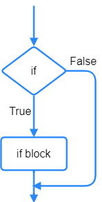
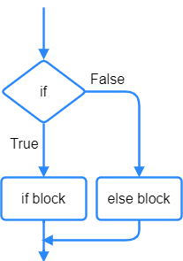
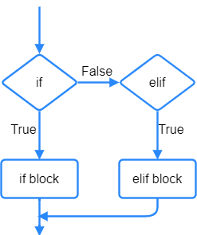
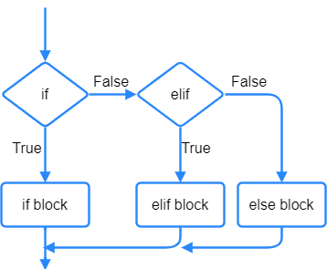
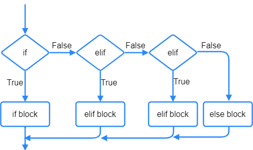

====================================================
Selection
====================================================

| ``if``, ``elif`` and ``else`` provide choices or branches in the code.
| They all are used in lines of code which end with a colon, ``:``.
| Both ``if`` and ``elif`` test a condition that returns ``True`` or ``False``. Their indented code block runs if the condition is True.
| Multiple ``elif`` can be used to provide more choices.
| The ``else`` block does not have a condition.
| The ``else`` block only runs if all the previous conditions were ``False``.

----

if
----------------------------------------

| ``if`` requires a condition that returns ``True`` or ``False``.

.. code-block:: python

    x = 10
    if x > 0:
        x = x - 1
        print(x)
                                                                  
----

if - else
----------------------------------------

| The ``else`` block does not have a condition.
| The ``else`` block only runs if all the previous conditions were ``False``.

.. code-block:: python

    x = 10
    if x > 0:
        x = x - 1
        print(x)
    else:
        print("blastoff!")

----

if - elif
----------------------------------------

| ``elif`` can be used to provide another choice by testing to see if its condition is True.

.. code-block:: python

    x = 10
    if x > 0:
        x = x - 1
        print(x)
    elif x == 0:
        print("blastoff!")
        x = 10

----

If - elif - else
----------------------------------------

| Using ``if``, ``elif`` and ``else`` together provides 3 branches in the code.

.. code-block:: python

    x = 10
    if x > 0:
        x = x - 1
        print(x)
    elif x == 0:
        print("blastoff!")
    else:
        x = 10

 
----

If - elif - elif - else
----------------------------------------

| Using ``if``, two ``elif`` and ``else`` together provides 4 branches in the code.
| The logical keyword ``and`` requires both conditions to be True for the combined condition to be True.

.. code-block:: python

    x = 10
    y = 10
    if x > 0 and y > 0:
        x = x - 1
        print(x)
    elif x == 0:
        print("blastoff!")
    elif x == 0:
        print("blastoff!")
    else:
        x = 10

