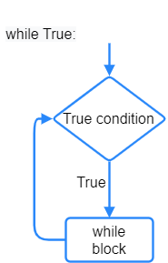

====================================================
While True loops
====================================================

| See: https://www.w3schools.com/python/python_while_loops.asp
| While loops run a set of statements as long as a test condition is true.

While true
----------------------------------------

| ``while True:`` loops run forever.
| Instead of using a condition that returns True or False, ``True`` is used in place of the condition to make the condition always True. As a result, the while loop runs forever.

| The statements within the loop are indented with the tab key (which is equivalent to 4 spaces) to make those lines part of the while loop.

| The ``while True`` loop below prints the text ``I never stop``, over and over again.

.. code-block:: python

    while True:
        print('I never stop')

