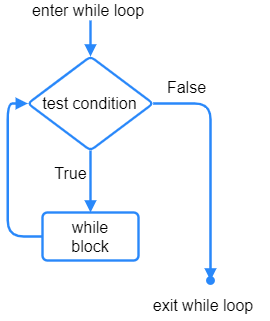
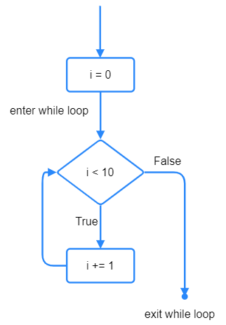

====================================================
While loops
====================================================

| See: https://www.w3schools.com/python/python_while_loops.asp
| While loops run a set of statements as long as a test condition is true.
| The statements within the loop are indented.

----

Events as conditions
----------------------------------------

| While loops have a condition that is tested each time the loop runs.
| The condition must be True for the loop to run.
| If the condition is False, the loop is exited.

| In the code below, the code within the while loop runs only while the x is greater than 10.

.. code-block:: python

    x = 10
    while x > 0 :
        print(x)
        x = x - 1
    x = 10

----

Counters
----------------------------------------

| While loops have a condition that is tested each time the loop runs.
| The condition must be True for the loop to run.
| If the condition is False, the loop is exited.

| A counter can be used in the while loop condition.
| The counter is set before the while loop.
| The counter is incremented (increased by a constant amount) in a while loop. 

----

Counting up
----------------------------------------

| In the example below, ``i`` is the counter.
| ``i`` starts off at 0 and is increased by 1 in the while loop line: ``i += 1``.
| ``i += 1`` is the same as ``i = i + 1``
| While the condition, ``i < 10``, is True the while loop runs.
| ``i += 1`` causes ``i`` to increase from 0 to 9.
| The while loop exits when ``i`` is 10 since ``i < 10`` will be False when ``i = 10``.

.. code-block:: python

    i = 0
    while i < 10:
        print(i)
        i += 1

----

Counting down
----------------------------------------

| In the code below, ``i`` starts off at 5 and is decreased by 1 in the while loop line: ``i -= 1``.
| ``i -+= 1`` is the same as ``i = i - 1``
| The test uses a ``>`` sign when counting down.
| The loop below stops when ``i`` is no longer greater than 1, i.e. when it is 1.

.. code-block:: python

    i = 5
    while i > 1:
        print(i)
        i -= 1

----

Step size
----------------------------------------

| The code below counts up from 0 to 10 in steps of 2. 
| ``i += 2`` sets a step size of 2.

.. code-block:: python

    i = 0
    while i < 11:
        print(i)
        i += 2

----

.. admonition:: Tasks

    #. Write a while loop that counts up from 1 to 5, printing the numbers 1, 2, 3, 4, 5.
    #. Write a while loop that counts up from 3 to 12 in steps of 3, printing the numbers 3, 6, 9, 12.
    #. Write a while loop that counts down from 9 to 1, showprintinging the numbers 9, 8, 7, 6, 5, 4, 3, 2, 1.
    #. Write a while loop that counts down from 24 to 18 in steps of 2, printing the numbers 24, 22, 20, 18.
    #. Write 2 while loops to print 0 to 8 going up in 2s then 9 down to 1 going down in 2s.
 
    .. dropdown::
        :icon: codescan
        :color: primary
        :class-container: sd-dropdown-container

        .. tab-set::

            .. tab-item:: Q1

                Write a while loop that counts up from 1 to 5, printing the numbers 1, 2, 3, 4, 5.

                .. code-block:: python

                    i = 1
                    while i < 6:
                        print(i)
                        i += 1

            .. tab-item:: Q2

                Write a while loop that counts up from 3 to 12 in steps of 3, printing the numbers 3, 6, 9, 12.

                .. code-block:: python

                    i = 3
                    while i < 13:
                        print(i)
                        i += 3

            .. tab-item:: Q3

                Write a while loop that counts down from 9 to 1, printing the numbers 9, 8, 7, 6, 5, 4, 3, 2, 1.

                .. code-block:: python

                    i = 9
                    while i > 0:
                        print(i)
                        i -= 1

            .. tab-item:: Q4

                Write a while loop that counts down from 24 to 18 in steps of 2, printing the numbers 24, 22, 20, 18.

                .. code-block:: python

                    i = 24
                    while i > 17:
                        print(i)
                        i -= 2

            .. tab-item:: Q5

                Write 2 while loops to print 0 to 8 going up in 2s then 9 down to 1 going down in 2s.

                .. code-block:: python

                    i = 0
                    while i < 9:
                        print(i)
                        i += 2
                    i = 9
                    while i > 0:
                        print(i)
                        i -= 2

