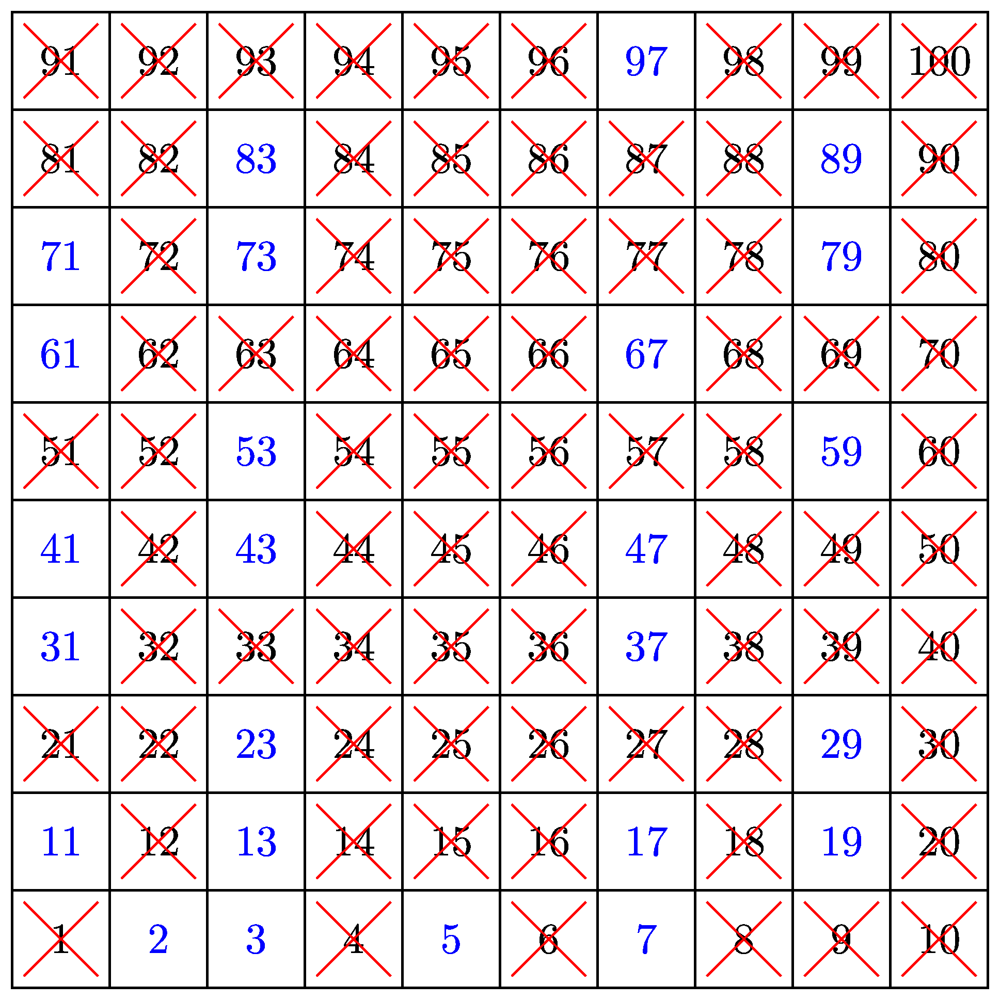

=======================
Sieve of Eratosthenes
=======================

| This Python code snippet uses iteration to implement the Sieve of Eratosthenes algorithm to find all prime numbers below 100.

----

Primes below 100
------------------------------

| This code creates a list of boolean values representing the numbers from 0 to n (in this case, n is 100). 
| It then iterates over the list, starting from the first prime number p (2), and marks all multiples of p as not prime. 
| This process is repeated for all numbers until p squared is greater than n. 
| Finally, the code iterates over the list of boolean values and appends the index of each True value to a list of prime numbers. 
| The resulting list of prime numbers is then printed.

.. code-block:: python

    n = 100
    prime = [True for i in range(n + 1)]
    p = 2
    while p * p <= n:
        if prime[p]:
            for i in range(p * p, n + 1, p):
                prime[i] = False
        p += 1

    primes = []
    for p in range(2, n):
        if prime[p]:
            primes.append(p)

    print(primes)

| This can be improved such that p is incremented until the next lowest prime is found. 
| In this version of the code, after marking all multiples of p as not prime, we enter a while loop that increments p until a True value is found. 
| This ensures that we only consider prime numbers as potential values for p.

.. code-block:: python

    n = 100
    prime = [True for i in range(n + 1)]
    p = 2
    while p * p <= n:
        if prime[p]:
            for i in range(p * p, n + 1, p):
                prime[i] = False
        while not prime[p]:
            p += 1

    primes = []
    for p in range(2, n):
        if prime[p]:
            primes.append(p)

    print(primes)
