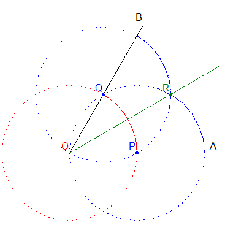

=======================
Angle bisection
=======================

| VC2M9SP03: level 9: Design, test and refine algorithms involving a sequence of steps and decisions based on geometric constructions and theorems; discuss and evaluate refinements

* creating and testing algorithms designed to construct or bisect angles, using pseudocode or flow charts

----

Angle bisector
------------------------------------------

| Here is simple directions for an algorithm to construct an angle bisector:

- Input: An angle with vertex O and rays OA and OB
- Step 1: Set the compass width to any convenient length and place the compass point at O
- Step 2: Draw an arc that intersects both rays OA and OB and label the intersection points as P and Q
- Step 3: Without changing the compass width, place the compass point at P
- Step 4: Draw an arc above the Angle
- Step 5: Without changing the compass width, place the compass point at Q
- Step 6: Draw an arc above the angle that intersects the arc drawn from P at R
- Step 7: Use the straightedge to draw a line segment from O through R
- Step 8: OR is the angle bisector

| Here is a diagram which illustrates the angle bisection.

| Here is the python to draw the angle bisection.

.. literalinclude:: files/angle_bisector.py
    :linenos:

