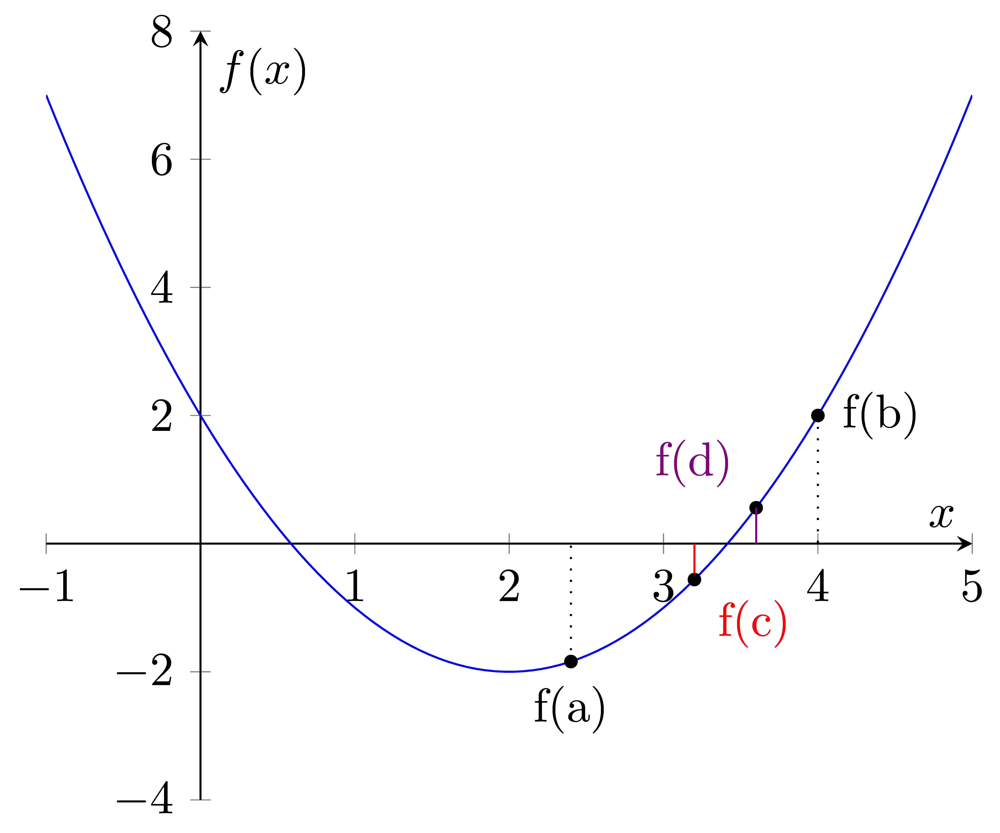

=======================
Bisection
=======================

| Numerical methods are algorithms that can be used to approximate the roots of a function. 

|      
| The bisection method works by repeatedly dividing an interval in half and checking which half contains a root. 
| The method starts with an interval `[a,b]` such that `f(a)` and `f(b)` have opposite signs, which means that there must be at least one root in the interval. 
| The midpoint of the interval is calculated as `c = (a + b) / 2`, and the function is evaluated at this point. 
| If `f(c)` is zero, then `c` is a root of the function. Otherwise, the sign of `f(c)` is compared to the sign of `f(a)` and `f(b)`. 
| If `f(c)` has the same sign as one of the endpoints, then the root must be in the other half of the interval, so the interval is updated accordingly. 
| This process is repeated until a sufficiently accurate approximation of the root is found.

| It's important to choose an appropriate initial interval or initial guess and to monitor the convergence of the method to ensure that it's providing accurate results.

----

Bisection with specified Iterations
------------------------------------------

| Pseudocode for the bisection method is below.
| This code defines a function bisection that takes four arguments: f, a, b, and max_iter. 
| The function checks if the product of f(a) and f(b) is greater than 0. If it is, it returns "Invalid interval". 
| Otherwise, it enters a while loop that iterates max_iter times. 
| During each iteration, the code calculates the midpoint between a and b and checks if f(mid) is equal to 0. 
| If it is, the function returns mid. 
| If not, the code checks if the product of f(a) and f(mid) is less than 0. 
| If it is, the value of b is updated to be equal to mid. 
| Otherwise, the value of a is updated to be equal to mid. 
| The loop counter i is then incremented by 1. 
| After the loop has completed, the function returns the final value of mid.

| Pseudocode:

| **define** bisection (f(x), a, b, max_iter)
|     **if** f(a) x f(b) > 0 **then**		
|         **return** "Invalid interval"
|     i ← 0 
|     **while** i < max_iter
|         mid ← (a + b) ÷ 2 
|         **if** f(mid) = 0 **then** 
|             **return** mid 
|         **else if** f(a) x f(mid) < 0 **then** 
|             b ← mid 
|         **else**
|             a ← mid 
|         i ← i + 1 
|     **end while** 
|     **return** mid 

| Python implementation:

.. code-block:: python

    def bisection(f, a, b, max_iter):
        if f(a) * f(b) > 0:
            return "Invalid interval"
        i = 0
        while i < max_iter:
            mid = (a + b) / 2
            if f(mid) == 0:
                return mid
            elif f(a) * f(mid) < 0:
                b = mid
            else:
                a = mid
            i += 1
        return mid

----

Cubic Example
----------------

.. image:: files/bisection_cubic.png
    :width: 600
    :align: center

|    
| Here's an example of how you can use the bisection function to find the root of a cubic function in the interval [1, 3] with a maximum of 10 Iterations.
| The output value is 2.123046875.

.. code-block:: python

    def f(x):
        return x**3 - 6.5*x**2 + 10*x - 1.5

    def bisection(f, a, b, max_iter):
        if f(a) * f(b) > 0:
            return "Invalid interval"
        i = 0
        while i < max_iter:
            mid = (a + b) / 2
            if f(mid) == 0:
                return mid
            elif f(a) * f(mid) < 0:
                b = mid
            else:
                a = mid
            i += 1
        return mid

        bisec_value = bisection(f,1,3,10) 

        print(bisec_value)
        # 2.123046875

----

Example with sin function
----------------------------

| Here's an example of how you can use the bisection function to find the root of the sin(x) function in the interval [2, 4] with a maximum of 5 Iterations.
| The output value is 3.1875.

.. code-block:: python

    from math import sin

    f = lambda x: sin(x)

    def bisection(f, a, b, max_iter):
        if f(a) * f(b) > 0:
            #need one pos and one neg
            return "Invalid interval"
        i = 0
        while i < max_iter:
            mid = (a + b) / 2
            if f(mid) == 0:
                return mid
            elif f(a) * f(mid) < 0:
                b = mid
            else:
                a = mid
            i += 1
        return mid

    bisec_value = bisection(f,2,4,5) 

    print(bisec_value)
    # 3.1875

----

Bisection with specified error tolerance
------------------------------------------

| The bisection method can check how close the y value is to zero when estimating the root of the equation and stop when a certain tolerance, max_diff, has been reached.
| A print statement is included to output the x and y values at each Iteration.

| Pseudocode:

| **define** bisection (f(x), a, b, max_iter, max_diff)
|     **if** f(a) x f(b) > 0 **then**		
|         **return** "Invalid interval"
|     i ← 0 
|     **while** i < max_iter
|         mid ← (a + b) ÷ 2
|         **print** ("Iteration i: a, b, mid, y")
|         **if** abs(f(mid)) <= max_diff **then** 
|             **return** mid 
|         **else if** f(a) x f(mid) < 0 **then** 
|             b ← mid 
|         **else**
|             a ← mid 
|         i ← i + 1 
|     **end while** 
|     **return** mid 

| Python implementation:

.. code-block:: python

    def bisection(f, a, b, max_iter, max_diff):
        if f(a) * f(b) > 0:
            return "Invalid interval"
        i = 0
        while i < max_iter:
            mid = (a + b) / 2
            print('Iteration {:2d}: a={:.10f}, b={:.10f}, mid={:.10f}, y={: .10f}'.format  (i, a, b, mid, f(mid)))
            if abs(f(mid)) <= max_diff:
                return mid
            elif f(a) * f(mid) < 0:
                b = mid
            else:
                a = mid
            i += 1
        return mid

----

Cubic Example
----------------

| Here's an example of how you can use the bisection function to find the root of a cubic function in the interval [1, 3] with a maximum error in the y value of 0.0001.
| The output value is 2.12353515625.

.. code-block:: python

    def f(x):
        return x**3 - 6.5*x**2 + 10*x - 1.5

    def bisection(f, a, b, max_iter, max_diff):
        if f(a) * f(b) > 0:
            return "Invalid interval"
        i = 0
        while i < max_iter:
            mid = (a + b) / 2
            print('Iteration {:2d}: a={:.10f}, b={:.10f}, mid={:.10f}, y={: .10f}'.format  (i, a, b, mid, f(mid)))
            if abs(f(mid)) <= max_diff:
                return mid
            elif f(a) * f(mid) < 0:
                b = mid
            else:
                a = mid
            i += 1
        return mid

    bisec_value = bisection(f,1,3,100,0.0001) 

    print(bisec_value)
    # 2.12353515625

.. parsed-literal::

    Table of values:
    Iteration  0: a=1.0000000000, b=3.0000000000, mid=2.0000000000, y= 0.5000000000
    Iteration  1: a=2.0000000000, b=3.0000000000, mid=2.5000000000, y=-1.5000000000
    Iteration  2: a=2.0000000000, b=2.5000000000, mid=2.2500000000, y=-0.5156250000
    Iteration  3: a=2.0000000000, b=2.2500000000, mid=2.1250000000, y=-0.0058593750
    Iteration  4: a=2.0000000000, b=2.1250000000, mid=2.0625000000, y= 0.2482910156
    Iteration  5: a=2.0625000000, b=2.1250000000, mid=2.0937500000, y= 0.1214294434
    Iteration  6: a=2.0937500000, b=2.1250000000, mid=2.1093750000, y= 0.0578269958
    Iteration  7: a=2.1093750000, b=2.1250000000, mid=2.1171875000, y= 0.0259928703
    Iteration  8: a=2.1171875000, b=2.1250000000, mid=2.1210937500, y= 0.0100688338
    Iteration  9: a=2.1210937500, b=2.1250000000, mid=2.1230468750, y= 0.0021052286
    Iteration 10: a=2.1230468750, b=2.1250000000, mid=2.1240234375, y=-0.0018769512
    Iteration 11: a=2.1230468750, b=2.1240234375, mid=2.1235351562, y= 0.0001141696
    Iteration 12: a=2.1235351562, b=2.1240234375, mid=2.1237792969, y=-0.0008813832
    Iteration 13: a=2.1235351562, b=2.1237792969, mid=2.1236572266, y=-0.0003836049
    Iteration 14: a=2.1235351562, b=2.1236572266, mid=2.1235961914, y=-0.0001347172
    Iteration 15: a=2.1235351562, b=2.1235961914, mid=2.1235656738, y=-0.0000102737

