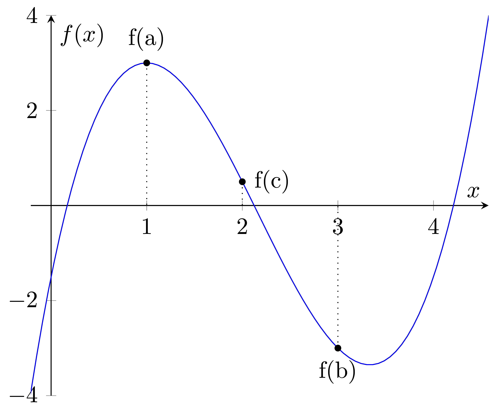

=======================
Bisection
=======================

| Numerical methods are algorithms that can be used to approximate the roots of a function. 

| The bisection method works by repeatedly dividing an interval in half and checking which half contains a root. The method starts with an interval $[a,b]$ such that $f(a)$ and $f(b)$ have opposite signs, which means that there must be at least one root in the interval. The midpoint of the interval is calculated as $c = (a + b) / 2$, and the function is evaluated at this point. If $f(c)$ is zero, then $c$ is a root of the function. Otherwise, the sign of $f(c)$ is compared to the sign of $f(a)$ and $f(b)$. If $f(c)$ has the same sign as one of the endpoints, then the root must be in the other half of the interval, so the interval is updated accordingly. This process is repeated until a sufficiently accurate approximation of the root is found.

| It's important to choose an appropriate initial interval or initial guess and to monitor the convergence of the method to ensure that it's providing accurate results.

| Pseudocode for the bisection method is below.
| This code defines a function bisection that takes four arguments: f, a, b, and max_iter. 
| The function checks if the product of f(a) and f(b) is greater than 0 and returns "Invalid interval" if it is. 
| Otherwise, it enters a while loop that iterates max_iter times. 
| In each iteration, the code calculates the midpoint between a and b and checks if f(mid) is equal to 0. 
| If it is, the function returns mid. 
| If not, the code checks if the product of f(a) and f(mid) is less than 0. 
| If it is, the value of b is updated to be equal to mid. 
| Otherwise, the value of a is updated to be equal to mid. 
| The loop counter i is then incremented by 1. 
| After the loop has completed, the function returns the final value of mid.

| Pseudocode:

| **define** bisection (f(x), a, b, max)
|     **if** f(a) x f(b) > 0 **then**		
|         **return** "Invalid interval"
|     i ← 0 
|     **while** i < max
|         mid ← (a + b) ÷ 2 
|         **if** f(mid) = 0 **then** 
|             **return** mid 
|         **else if** f(a) x f(mid) < 0 **then** 
|             b ← mid 
|         **else**
|             a ← mid 
|         i ← i + 1 
|     **end while** 
|     **return** mid 

| Python implementation:

.. code-block:: python

    def bisection(f, a, b, max_iter):
        if f(a) * f(b) > 0:
            return "Invalid interval"
        i = 0
        while i < max_iter:
            mid = (a + b) / 2
            if f(mid) == 0:
                return mid
            elif f(a) * f(mid) < 0:
                b = mid
            else:
                a = mid
            i += 1
        return mid

----

Cubic Example
----------------

| Here's an example of how you can use the bisection function to find the root of a cubic function in the interval [1, 3] with a maximum of 4 iterations.
| The output value is .

.. code-block:: python

    def f(x):
        return x**3 - 6.5*x**2 + 10*x - 1.5

    def bisection(f, a, b, max_iter):
        if f(a) * f(b) > 0:
            return "Invalid interval"
        i = 0
        while i < max_iter:
            mid = (a + b) / 2
            if f(mid) == 0:
                return mid
            elif f(a) * f(mid) < 0:
                b = mid
            else:
                a = mid
            i += 1
        return mid

        bisec_value = bisection(f,1,3,10) 

        print(bisec_value)
        # 2.123046875

----

Example with sin function
----------------------------

.. image:: images/bisection_sin.png
    :scale: 75 %
    :align: center

| Here's an example of how you can use the bisection function to find the root of the sin(x) function in the interval [2, 4] with a maximum of 5 iterations.
| The output value is 3.1875.

.. code-block:: python

    from math import sin

    f = lambda x: sin(x)

    def bisection(f, a, b, max_iter):
        if f(a) * f(b) > 0:
            #need one pos and one neg
            return "Invalid interval"
        i = 0
        while i < max_iter:
            mid = (a + b) / 2
            if f(mid) == 0:
                return mid
            elif f(a) * f(mid) < 0:
                b = mid
            else:
                a = mid
            i += 1
        return mid

    bisec_value = bisection(f,2,4,5) 

    print(bisec_value)
    # 3.1875

