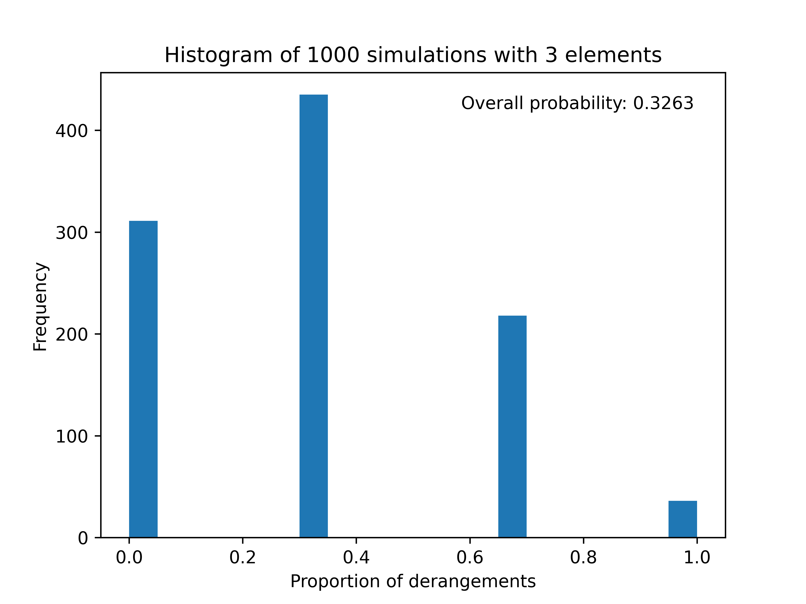
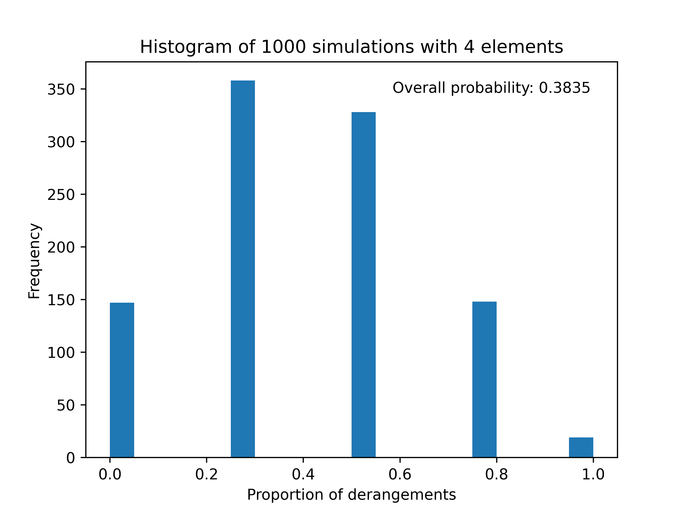
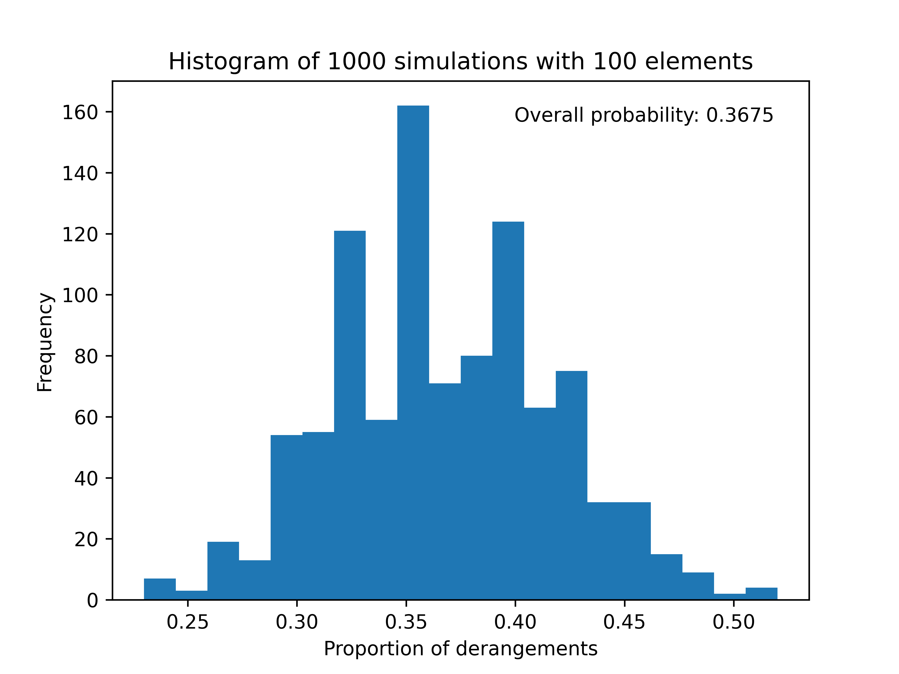

=======================
Derangements
=======================

| VCMNA358: level 10A: Devise and use algorithms and simulations to solve mathematical problems

* Developing simulations for counter-intuitive problems in probability such as the Monty Hall problem or derangements

----

Derangements theory
--------------------------

A derangement is a **permutation** of a set of elements that leaves **no element** in its original position. For example, if the original set is {1, 2, 3}, then a derangement could be {2, 3, 1} or {3, 1, 2}, but not {1, 3, 2} or {2, 1, 3}.

The number of derangements of n elements is denoted by !n and can be calculated by the formula:

!n = n! * (1 - 1/1! + 1/2! - 1/3! + ... + (-1)^n / n!)

The probability of a random permutation of n elements being a derangement is given by the limit of !n / n! as n approaches infinity, which is approximately 0.3679. This is also known as the **derangement constant**. It is equal to 1/e.

----

Derangement simulation
-----------------------

| The result of multiples trials of derangement with 3, 4 and 100 elements is below:

| Python code for the simulation:

.. literalinclude:: files/derangement.py
    :linenos:
