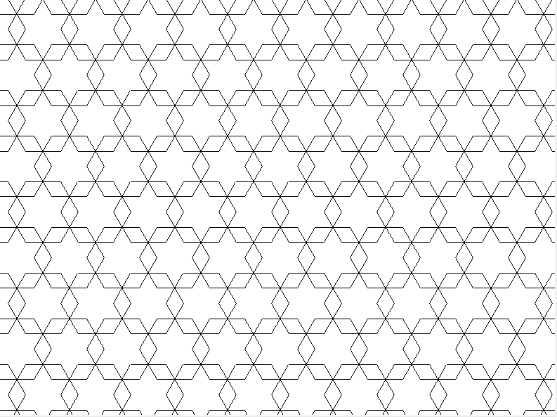

=======================
Geomteric patterns
=======================

| VCMNA254: Design and implement mathematical algorithms using a simple general purpose programming language

* constructing geometric patterns such as a honeycomb, using dynamic geometry functionality

| The python turtle module can be used to generate patetrns of shapes.

----

Turtle basics
----------------

See: https://pc-python.readthedocs.io/en/latest/turtle/turtle_drawing.html

----

Square patterns
--------------------

.. image:: images/squares.png
    :scale: 75 %
    :align: center

.. image:: images/squares_at_45.png
    :scale: 75 %
    :align: center

.. literalinclude:: files/square_grid.py
   :linenos:

----

Hexagon patterns
--------------------

.. image:: images/hexagon_diamonds.png
    :scale: 75 %
    :align: center

.. literalinclude:: files/hexagon_diamonds.py
   :linenos:

.. image:: images/hexagon_tessalation.png
    :scale: 75 %
    :align: center

.. literalinclude:: files/hexagon_tessalation.py
   :linenos:

.. literalinclude:: files/hexagons_overlap.py
   :linenos:

