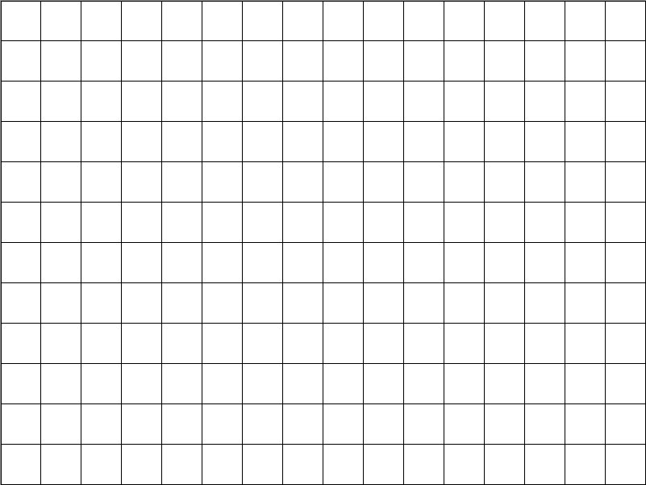
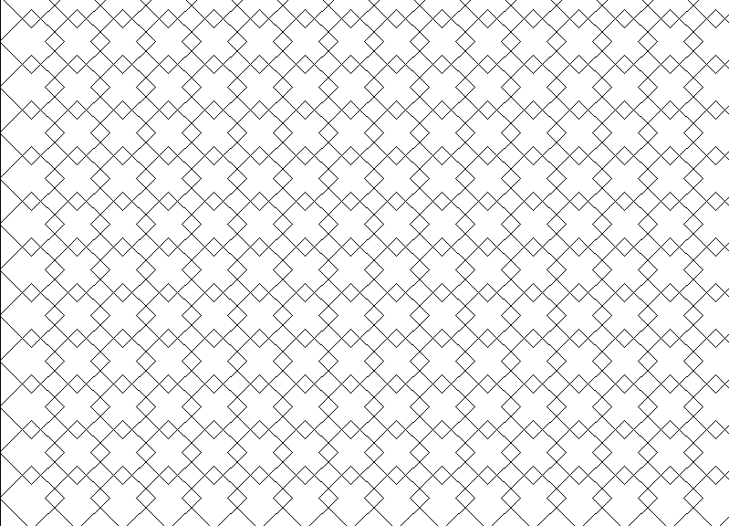
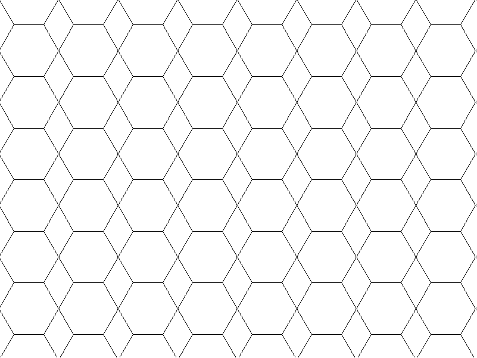
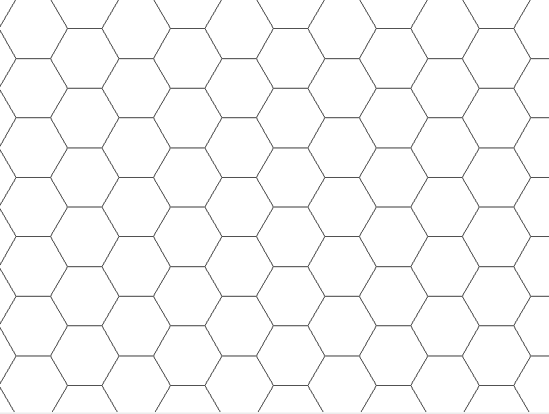

=======================
Geometric patterns
=======================

| VCMNA254: level 7: Design and implement mathematical algorithms using a simple general purpose programming language

* constructing geometric patterns such as a honeycomb, using dynamic geometry functionality

----

Turtle basics
----------------

| The python turtle module can be used to generate patterns of shapes.
| See: https://pc-python.readthedocs.io/en/latest/turtle/turtle_drawing.html

----

Tessellation (tiling)
----------------------

| A tessellation is a repeated pattern in the plane or on a surface where shapes completely fill all the space around a given point where their boundaries meet. 
| For example, a honeycomb is a tessellation using hexagons. 
| Tiling patterns are tessellations using rectangular tiles or brick pavers in paths, mosaics in buildings, quilts and art.
| A regular tessellation is created by tessellating regular polygons. 
| If more than one regular polygon is used, it is a semi-regular tessellation.

----

Square patterns
--------------------

| A grid of squares

| Squares rotated 45 degrees.

|  
|  Python code for both examples, where the initial angle can be set to 0 or 45 degrees.

.. literalinclude:: files/square_grid.py
    :linenos:

----

Hexagon patterns
--------------------

| Aligned touching hexagons creating diamond gaps.

|  
|  Python code:

.. literalinclude:: files/hexagon_diamonds.py
    :linenos:
  
----

| Staggered hexagons creating a tessalation with no overlap.

|  
|  Python code:

.. literalinclude:: files/hexagon_tessalation.py
    :linenos:

----

| Overlapping hexagons. The overlap_factor can be varied from 0.5 for tiangles to 1.0 for hexagons with triangular gaps.

.. grid:: 2
    :gutter: 0
    :margin: 0
    :padding: 0

    .. grid-item-card::  

        hexagons_overlap_50
        ^^^

        .. figure:: images/hexagons_overlap_50.png
            :width: 300
            :alt: hexagons_overlap_50
            :figclass: align-center

    .. grid-item-card::

        hexagons_overlap_67
        ^^^

        .. figure:: images/hexagons_overlap_67.png
            :width: 300
            :alt: hexagons_overlap_67
            :figclass: align-center

.. grid:: 2
    :gutter: 0
    :margin: 0
    :padding: 0

    .. grid-item-card::  

        hexagons_overlap_75
        ^^^

        .. figure:: images/hexagons_overlap_75.png
            :width: 300
            :alt: hexagons_overlap_75
            :figclass: align-center

    .. grid-item-card::

        hexagons_overlap_100
        ^^^

        .. figure:: images/hexagons_overlap_100.png
            :width: 300
            :alt: hexagons_overlap_100
            :figclass: align-center

|  
|  Python code:

.. literalinclude:: files/hexagons_overlap.py
   :linenos:

