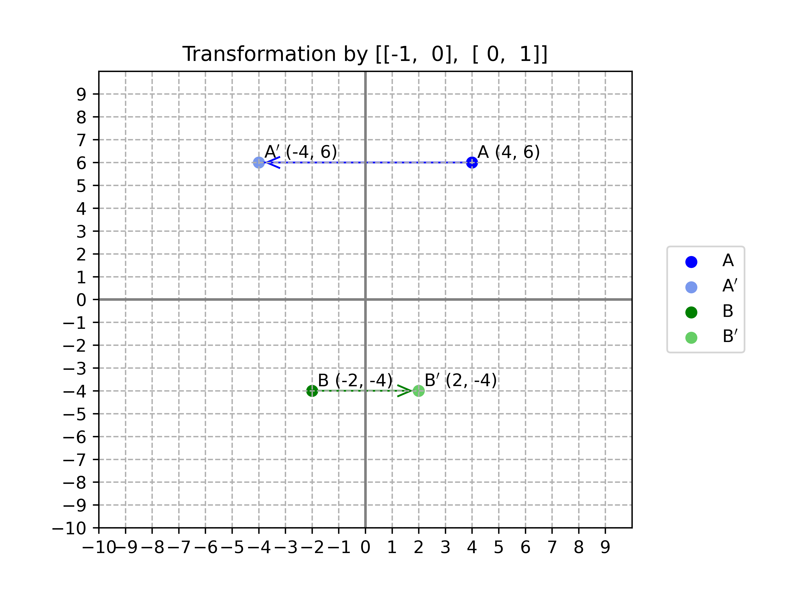
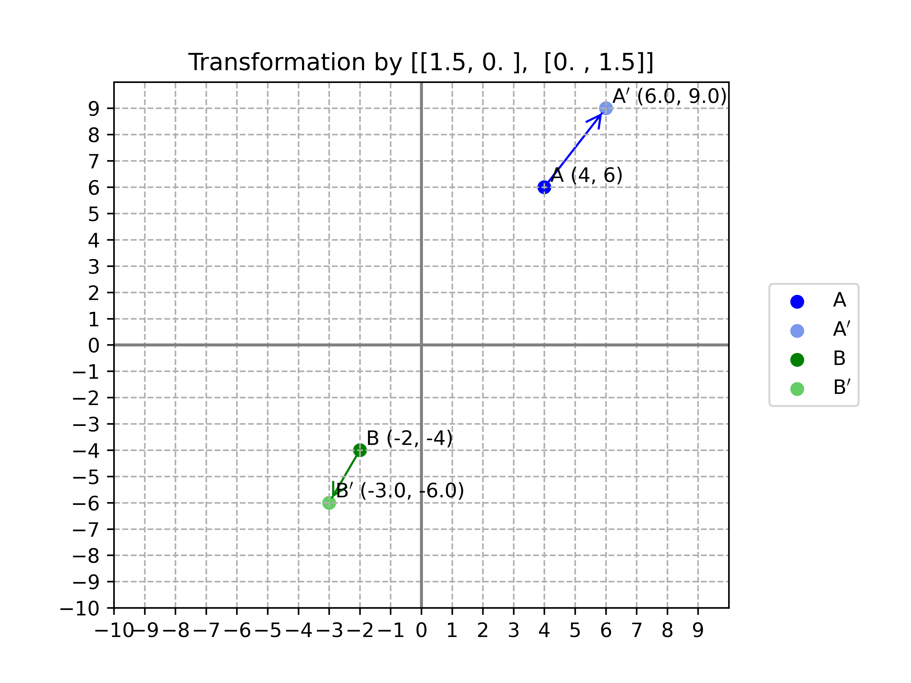

=======================
Matrix transformations
=======================

| VCMNA334: level 10: Implement algorithms using data structures in a general-purpose programming language

* Using two-dimensional arrays such as matrices to represent and implement sequences of transformations of sets of points in the plane

----

Translation
-----------------

| The  translation is shown below.

| Python code for a translation:

.. literalinclude:: files/matrix_translation.py
    :linenos:

----

Translation of multiple points
-------------------------------------

| The  translation of multiple points is shown below.

.. image:: images/matrix_translation_multiple_points.png
    :width: 600
    :align: center

| Python code for a translation:

.. literalinclude:: files/matrix_translation_multiple_points.py
    :linenos:

----

Transformations
--------------------

| Python code for a matrix transformation:

.. literalinclude:: files/matrix_transformation.py
    :linenos:

----

Reflections
---------------

| Examples of the reflection of multiple points is shown below.

----

Rotations
-------------------

| Examples of the rotation of multiple points is shown below.

----

Dilation
-------------

| An example of dilation of multiple points is shown below.

