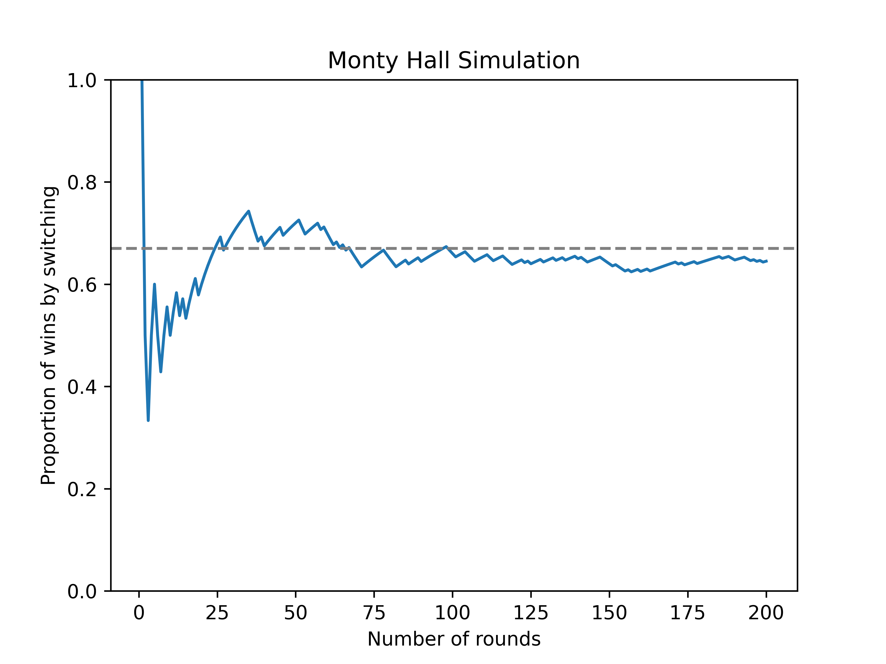

=======================
Monty Hall
=======================

| VCMNA358: level 10A: Devise and use algorithms and simulations to solve mathematical problems

* Developing simulations for counter-intuitive problems in probability such as the Monty Hall problem or derangements

----

Monty Hall simulation
-----------------------

| The Monty Hall problem is a counter-intuitive statistics puzzle.

| There are 3 doors, behind which are two goats and a car.
| You pick a door (call it door A). You're hoping for the car of course.
| Monty Hall, the game show host, examines the other doors (B & C) and opens one with a goat. (If both doors have goats, he picks randomly.)
| Do you stick with door A (original guess) or switch to the unopened door? Does it matter?
| Surprisingly, the odds aren't 50-50. If you switch doors you'll win 2/3 of the time!

| Long term chances are shown below:

| Python code for the simulation:

.. literalinclude:: files/monty_hall.py
    :linenos:

----

Monty Hall explanation
------------------------

| The Monty Hall problem is a brain teaser, in the form of a probability puzzle, loosely based on the American television game show Let's Make a Deal and named after its original host, Monty Hall. 

| The problem is as follows:
| Suppose you're on a game show, and you're given the choice of three doors: 
| Behind one door is a car; behind the others, goats. 
| You pick a door, say No. 1, and the host, who knows what's behind the doors, opens another door, say No. 3, which has a goat. 
| He then says to you, "Do you want to pick door No. 2?" 
| Is it to your advantage to switch your choice?

| The surprising answer is that **switching is better than staying**. 
| If you switch, you have a **2/3** chance of winning the car, while if you stay, you have only a **1/3** chance. 
| This is because when you first choose a door, there is a 2/3 chance that the car is behind one of the other doors. 
| This probability does not change after the host reveals a goat behind one of the unchosen doors. 
| When the host provides information about the 2 unchosen doors (revealing that one of them does not have the car behind it), the 2/3 chance of the car being behind one of the unchosen doors rests on the unchosen and unrevealed door, as opposed to the 1/3 chance of the car being behind the door you chose initially.

| A common misconception is that switching or staying does not matter because there are only two doors left and each has an equal chance of having the car. 
| However, this ignores the fact that **switching and staying are not independent events**. 
| Switching uses the previous information given by the host, while staying does not. 
| Switching is equivalent to choosing both of the other doors at the beginning, while staying is equivalent to choosing only one door at the beginning.

| One way to see why switching is better is to list out all the possible outcomes and count how often you win by switching or staying. 
| Suppose you choose door 1 initially. Then there are three scenarios:

- The car is behind door 1, and the host reveals either door 2 or 3 (both have goats). If you switch, you lose; if you stay, you win.
- The car is behind door 2, and the host reveals door 3 (which has a goat). If you switch to door 2, you win; if you stay at door 1, you lose.
- The car is behind door 3, and the host reveals door 2 (which has a goat). If you switch to door 3, you win; if you stay at door 1, you lose.

| Out of three scenarios, switching wins twice and staying wins once. 
| Therefore, switching has a 2/3 probability of winning and staying has a 1/3 probability of winning.
