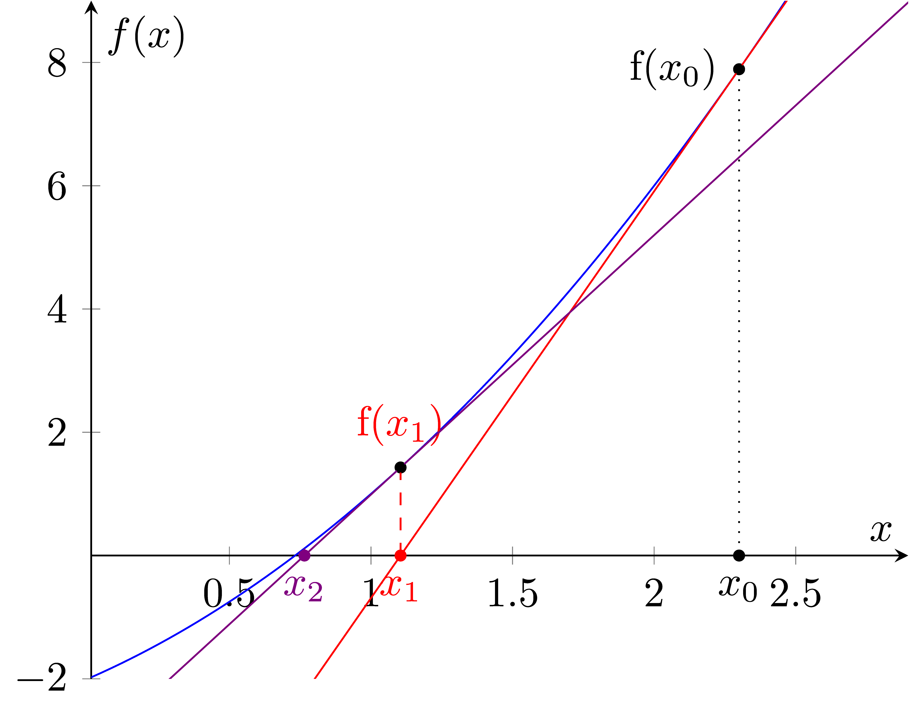
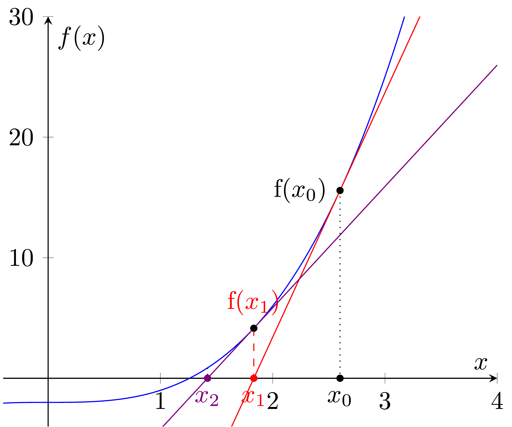

=======================
Newton's method
=======================

| Pseudocode for Newton's method is below.
| Newton's method is an iterative method for finding the roots of a real-valued function. 
| It starts with an initial guess for the root (x0) and iteratively refines this guess using the formula x1 = x0 - f(x0) / f'(x0) until a desired level of accuracy is achieved (as determined by the tol parameter). 

| This pseudocode defines a function newton that takes five arguments: f(x), f'(x), x0, max_iter, and tol. 
| The function initializes a loop counter i to 0 and enters a while loop that iterates max_iter times. 
| The maximum number of iterations allowed is specified by the max_iter parameter.
| In each iteration, the code calculates a new value for x1 using the formula x1 = x0 - f(x0) / f'(x0). 
| It then checks if the absolute difference between x1 and x0 is less than tol. 
| If it is, the function returns x1. 
| Otherwise, the value of x0 is updated to be equal to x1 and the loop counter i is incremented by 1. 
| After the loop has completed, the function returns the final value of x1.

| Pseudocode:

| **define** newton(f(x), f'(x), x0, max_iter, tol)
|     i ← 0
|     **while** i < max_iter
|         x1 ← x0 - f(x0) / f'(x0)
|         **if** abs(x1 - x0) < tol **then**
|             **return** x1
|         x0 ← x1
|         i ← i + 1
|     **return** x1

| Python implementation:

.. code-block:: python

    def newton(f, df, x0, max_iter, tol):
        i = 0
        while i < max_iter:
            x1 = x0 - f(x0) / df(x0)
            if abs(x1 - x0) < tol:
                return x1
            x0 = x1
            i += 1
        return x1

----

Usage Example
----------------

| Here's an example of how you can use the newton function to find the root of the function y = x**3 - 2.
| The output value is 1.2599210498953948.
| This code defines the newton function as described in the pseudocode. 
| It then defines two lambda functions: f and df. 
| The f function calculates the value of x**3 - 2 for a given value of x, while the df function calculates the derivative of f, which is 3 * x**2. 
| The code then calls the newton function with f set to the f lambda function, df set to the df lambda function, x0 set to an initial guess of 1.5, max_iter set to 100, and tol set to 1e-6. 
| The result of this call is stored in the variable result and printed.

| When run, this code outputs a value of approximately 1.2599210498948732. 
| This is an approximate root of the function y = x**3 - 2 found using Newton's method with an initial guess of 1.5, a maximum of 100 iterations, and a tolerance of 1e-6.

.. code-block:: python

    def newton(f, df, x0, max_iter, tol):
        i = 0
        while i < max_iter:
            x1 = x0 - f(x0) / df(x0)
            if abs(x1 - x0) < tol:
                return x1
            x0 = x1
            i += 1
        return x1

    f = lambda x: x**3 - 2
    df = lambda x: 3 * x**2

    result = newton(f, df, 1.5, 100, 1e-6)
    print(result)
    # 1.2599210498953948

