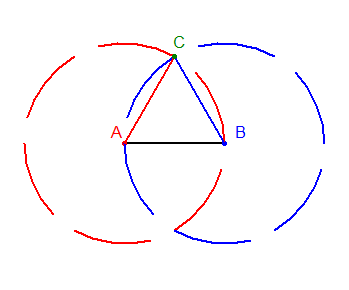

=======================
Polygon construction
=======================

| VC2M9SP03: level 9: Design, test and refine algorithms involving a sequence of steps and decisions based on geometric constructions and theorems; discuss and evaluate refinements

* developing an algorithm for an animation of a geometric construction, or a visual proof, evaluating the algorithm using test cases

| See: https://mathigon.org/task/geometric-constructions-regular-polygons

----

Equilateral triangle
---------------------

| Here is one (there are others) algorithm to construct an equilateral triangle:

- Input: a line segment AB with length L
- Step 1: Draw a circle C1 with center A and radius L
- Step 2: Draw a circle C2 with center B and radius L
- Step 3: Find the point C where C1 and C2 intersect
- Step 4: Draw a line segment AC
- Step 5: Draw a line segment BC
- Step 6: Triangle ABC is equilateral with side length L

| Here is a diagram which illustrates the equilateral triangle construction.

| Here is the python to draw the equilateral triangle construction.

.. literalinclude:: files/equilateral_triangle_construction.py
    :linenos:

