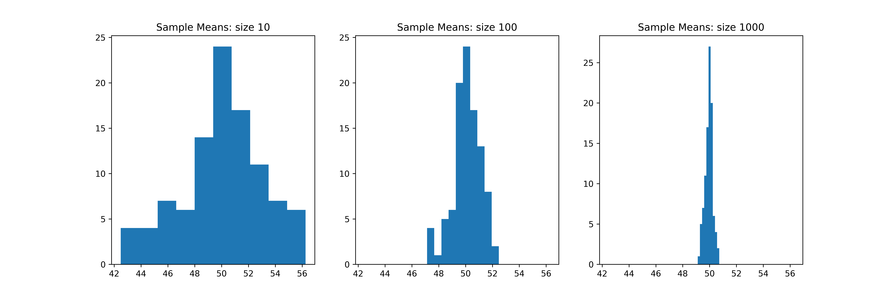

=======================
Population_sampling
=======================

| VCMNA307: Apply set structures to solve real-world problems

* Exploring variation in proportion and means of random samples, drawn from a population

----

Population mean
-------------------

| Population mean :math:`\mu` = :math:`\displaystyle \frac{\text{sum of all population values}}{\text{population size}}`
| To get the population mean, collect numerical data about every object in a population and calculate the mean using the formula above. 
| It is usually impractical or costly to be able to determine the population mean exactly.

----

Sample Mean
----------------

| Sample mean :math:`\bar{x}` = :math:`\displaystyle \frac{\text{sum of all sample values}}{\text{sample size}}`

| The sample mean is found by selecting a sample from the population and determining its mean instead.
| The sample mean will vary from sample to sample.
| The more representative the sample is of the population or the larger the size of the sample, the more likely the sample mean will provide a good estimate of the population mean.

----

Sample Means: Increasing samples
----------------------------------------

| What is the effect of increasing the number of samples taken on the estimate of the population mean?
| The code below generates a population of 10000 individuals with a mean of 50 and a standard deviation of 10. 
| It then draws random samples of a given size from the population and calculates the sample means. 
| Finally, it plots histograms of the sample means to visualize their variation.

.. image:: images/sample_means_inc_samples.png
    :width: 600
    :align: center

| Increasing the number of samples drawn from a population generally leads to more accurate estimates of the population mean. 
| This is because as the number of samples increases, the distribution of sample means tends to become more tightly clustered around the true population mean. 
| This phenomenon is known as the Central Limit Theorem.

| In other words, as the number of samples increase, the sample means are more likely to be close to the population mean, and the variation among the sample means decreases. 
| This can be seen in the histograms above: as the number of samples increases, the histograms become taller and narrower, indicating that the sample means are becoming more concentrated around the population mean.

.. literalinclude:: files/pop_mean_inc_samples.py
    :linenos:

----

Sample Means: Increasing sample size
----------------------------------------

| What is the effect of increasing the sample size on the estimate of the population mean?
| The code below generates a population of 10000 individuals with a mean of 50 and a standard deviation of 10. 
| It then draws random samples of a given size from the population and calculates the sample means. 
| Finally, it plots histograms of the sample means to visualize their variation.

| Increasing the size of the samples drawn from a population generally leads to more accurate estimates of the population mean. 
| This is because as the sample size increases, the sample means tend to become more tightly clustered around the true population mean. 
| This phenomenon is also a consequence of the Central Limit Theorem.

| As the sample size increases, the sample means are more likely to be close to the population mean, and the variation among the sample means decreases. 
| This can be seen in histograms of the sample means: as the sample size increases, the histograms become taller and narrower, indicating that the sample means are becoming more concentrated around the population mean.

| It's important to note that increasing the sample size has diminishing returns. 
| As the sample size gets larger and larger, the improvement in accuracy becomes smaller and smaller. 
| At some point, increasing the sample size further may not be worth the additional cost and effort.

.. literalinclude:: files/pop_mean_inc_sample_size.py
    :linenos:

----

Population Proportion
------------------------

| Population proportion :math:`p` = :math:`\displaystyle \frac{\text{number of objects with trait in population}}{\text{population size}}`
| The population proportion is found by collecting categorical data about every object in a population and calculating the proportion with a trait. 
| However, it isusually impractical or costly to be able to determine the population proportion exactly.

Sample Proportion
------------------------

| Sample proportion :math:`\hat{p}` = :math:`\displaystyle \frac{\text{number of objects with trait in sample}}{\text{sample size}}`
| The sample proportion is found by selecting a sample of that population and determining the proportion with a trait. 
| The more representative the sample is of the population or the larger the sample size, the more likely the sample proportion will provide a good estimate of the population proportion.
| The sample proportion can vary from sample to sample between 0 and 1.

