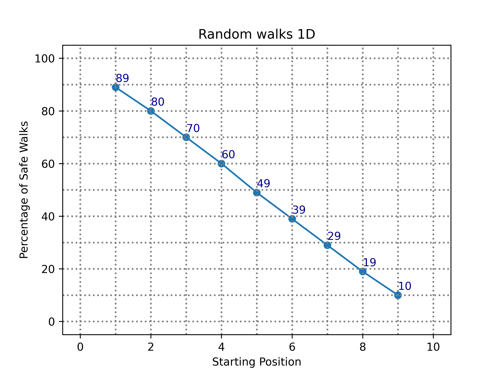
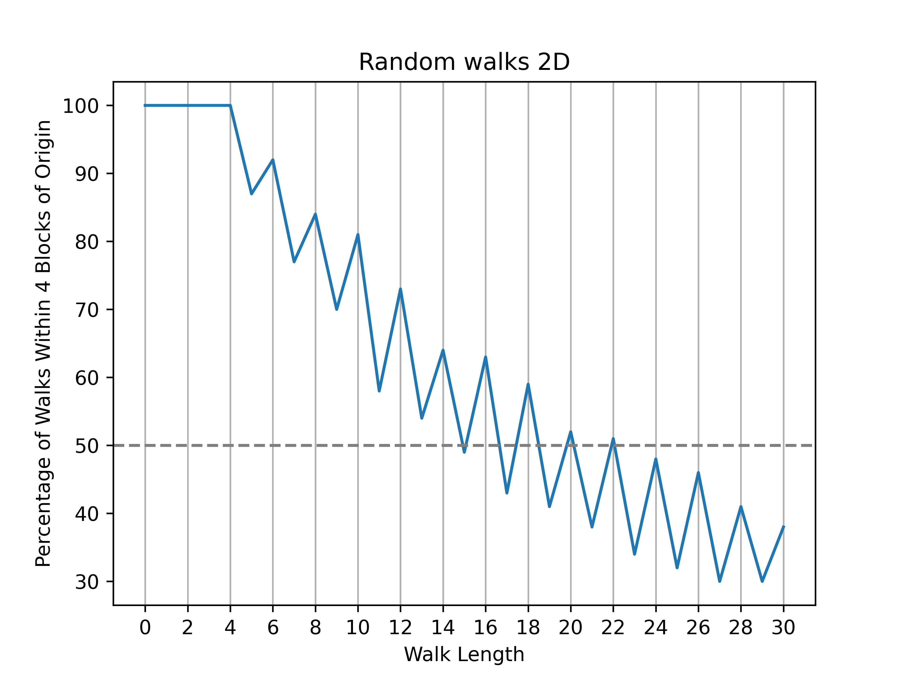

=======================
Random walks
=======================

| VCMNA194: Follow a mathematical algorithm involving branching and repetition (iteration) 

* simulating a simple random walk

----

Walking the plank
------------------------

| Simulate walking the plank on a pirate ship.
| Have 9 positions on the plank, from 1 to 9, with position 1 at the start of the plank and 9 at the end.

.. literalinclude:: files/random_walk_1D.py
    :linenos:

| The code below simulates a 1D random walk. 
| The `random_walk_1d` function takes a starting position as an argument, with a default value of 3. 
| The function simulates a random walk by generating random steps using the `random.randint` function. 
| If the step is 1, the position is incremented by 1, otherwise it is decremented by 1. 
| The new position is then appended to the `x_positions` list. 
| This continues until the position reaches either 0 or 10.

| The script then simulates `number_of_walks` walks for each starting position from 1 to 9. 
| For each walk, it checks if the final position is 0 and if so, increments the `safe_count` variable. 
| Finally, it prints the starting position and the percentage of walks that ended at position 0.

----

2D walks
------------------------

| The code below simulates a 2D random walk. 

.. literalinclude:: files/random_walks_2D.py
    :linenos:

| The `random_walk` function takes an argument `n` which represents the number of steps in the walk. 
| The function initializes the starting position at `(0, 0)` and then simulates the walk by generating random steps using the `random.choice` function. 
| The step is chosen from a list of possible steps: up, down, left, or right. 
| The new position is calculated by adding the step to the current position.

| The script then simulates `number_of_walks` walks for each walk length from 0 to 30. 
| For each walk, it checks if the final position is within (`dist_to_home`) 4 blocks of the origin (using the Manhattan distance) and if it is, increments the `close_to_home` variable. 
| Finally, for plotting, it returns the walk length and the percentage of walks that ended within 4 blocks of the origin.

| The Manhattan distance, also known as the taxicab distance or city block distance, is a way to measure the distance between two points in a grid-like space. 
| It is calculated as the sum of the absolute differences between the coordinates of the two points. 
| For example, if there are two points `P1` and `P2` with coordinates `(x1, y1)` and `(x2, y2)`, respectively, then the Manhattan distance between them is `abs(x1 - x2)` + `abs(y1 - y2)`. 
| This distance can be imagined as the length needed to move between two points in a grid where you can only move up, down, left or right.

