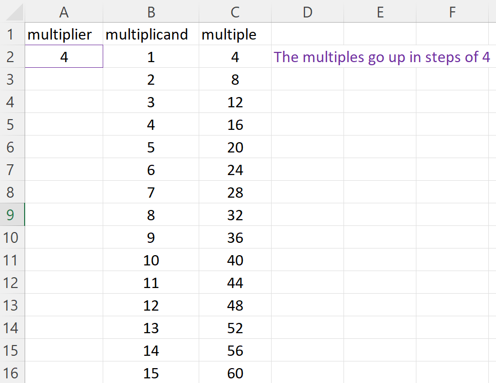

=======================
Spreadsheet fill down
=======================

| VC2M5N10: level 5: Follow a mathematical algorithm involving branching and repetition (iteration); create and use algorithms involving a sequence of steps and decisions and digital tools to experiment with factors, multiples and divisibility; identify, interpret and describe emerging patterns

* **using the 'fill down' function of a spreadsheet and a multiplication formula to generate a sequence of numbers that represent the multiples of any number you enter into the cell, and describing and explaining the emerging patterns**

----

Simple rule
------------------------

| A time table style generation of multiples of a given number is shown below.

:download:`spreadsheet<files/multiplication.xlsx>`

| When the multiplier is changed, all the multiples update using a formula such as `=$A$2*B2`.
| `$A$2` fixes the cell reference so that when the formula is filled down it always refers to `A2`.
| The values in column B go up by 1.
| Hence, the multiples go up by the same value as the multiplier, which is 4 in the image below.

