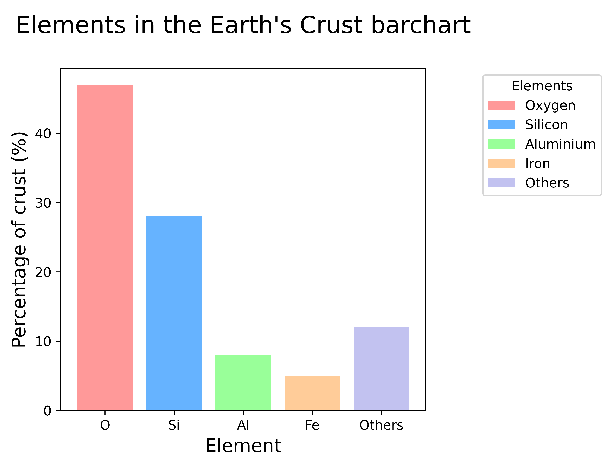

====================================================
Matplotlib bar chart
====================================================

| Matplotlib can be used to draw a bar chart.

----

----

Python code
-------------

| The python code is below.
| The code is commented to indicate what each part is doing.

.. literalinclude:: files/bar_chart_earth.py
    :linenos:

