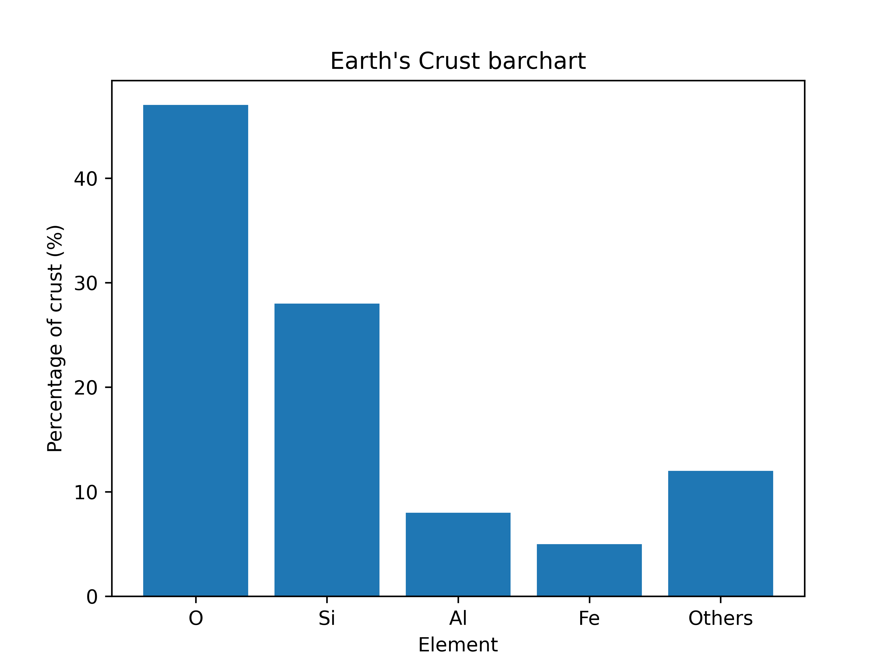
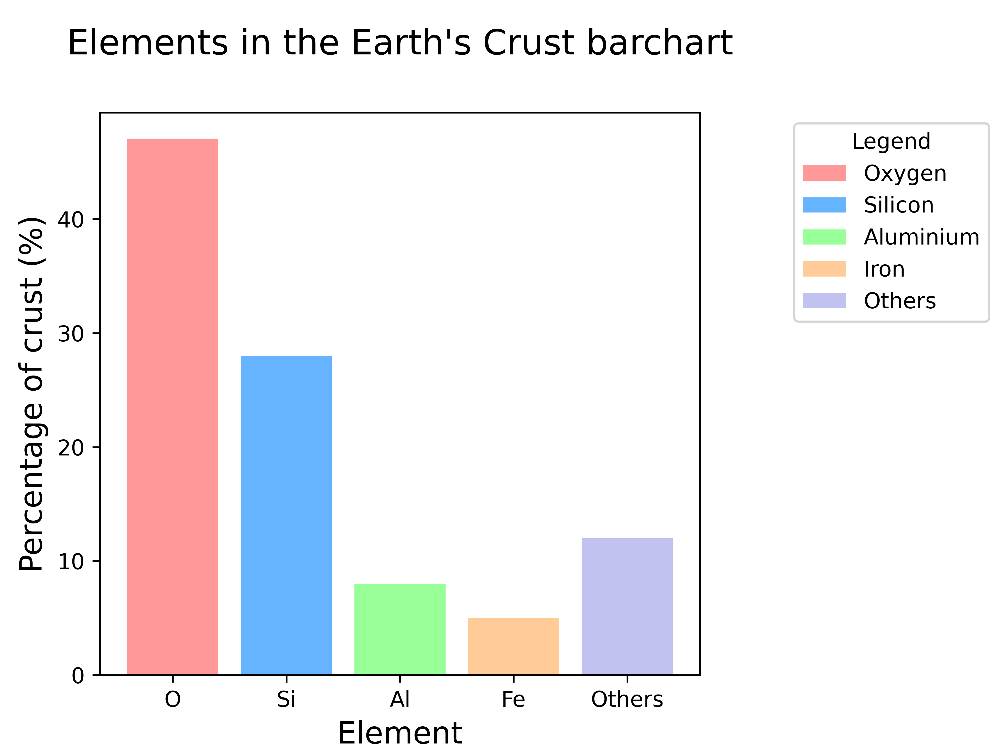

====================================================
Matplotlib bar chart
====================================================

| Matplotlib can be used to draw a bar chart.

----

Simple bar chart
------------------

| This is a simple bar chart.

----

Python code
-------------

| The python code is below.
| The code is commented to indicate what each part is doing.

.. literalinclude:: files/bar_chart_earth_simple.py
    :linenos:

----

Customized bar chart
------------------------

| This plot has more customizations added.
| It has code to save the bar chart as a png file.

----

Python code
-------------

| The python code is below.
| The code is commented to indicate what each part is doing.

.. literalinclude:: files/bar_chart_earth.py
    :linenos:
