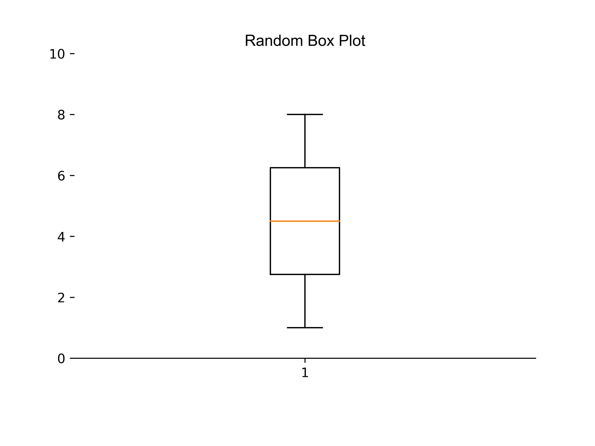
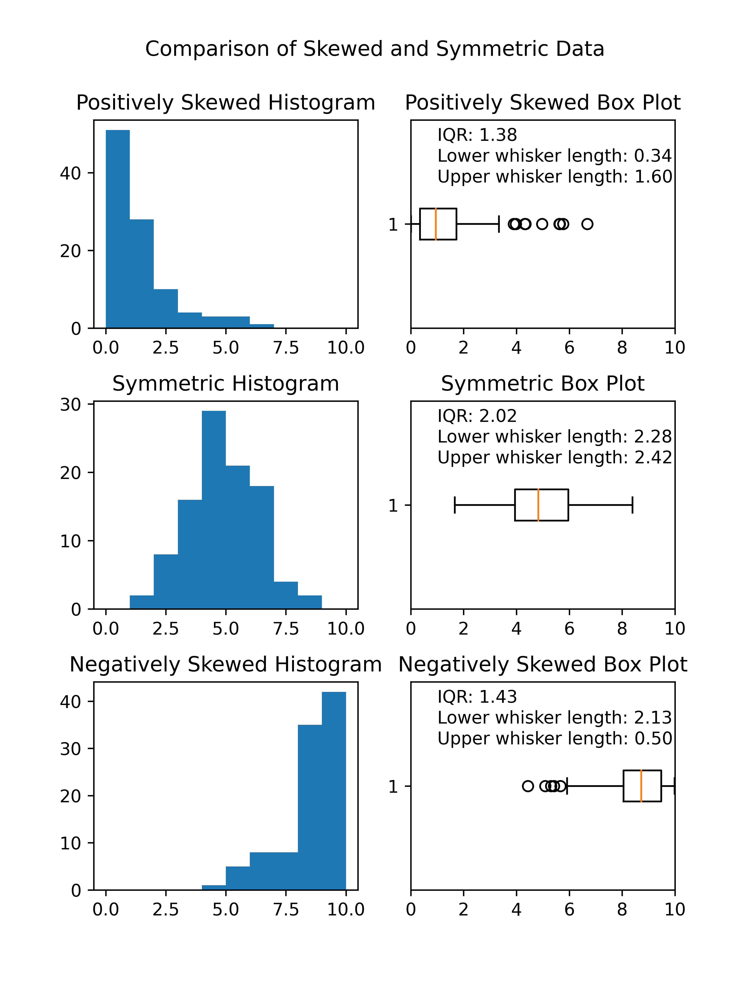

====================================================
Matplotlib box plot
====================================================

| Matplotlib can be used to draw a box plot.

| A box plot, also known as a box-and-whisker plot, is a graphical representation of a dataset that displays the distribution of the data using five summary statistics: the minimum, first quartile (Q1), median, third quartile (Q3), and maximum.

Here are the different parts of a box plot and what they represent:

- **Box**: The box represents the interquartile range (IQR), which is the range between the first quartile (Q1) and the third quartile (Q3) of the data. The height of the box is equal to the IQR and represents the middle 50% of the data.
- **Median line**: The median line is drawn inside the box and represents the median value of the data. The median is the middle value when the data is sorted in ascending order. If there is an even number of observations, the median is calculated as the average of the two middle values.
- **Whiskers**: The whiskers extend from the box to the smallest and largest observations that are not considered outliers. The length of the whiskers represents the range of the data within 1.5 times the IQR from Q1 or Q3.
- **Outliers**: Outliers are observations that fall outside 1.5 times the IQR from Q1 or Q3. In a box plot, outliers are plotted as individual points outside the whiskers.
- **Caps**: The caps are horizontal lines drawn at the ends of the whiskers. They represent the smallest and largest observations that are not considered outliers.

----

Random box plot
-----------------------

----

Python code
-------------

| The python code is below.
| The code is commented to indicate what each part is doing.

.. literalinclude:: files/box_plot.py
    :linenos:

----

Comparing skewness in  box plots
---------------------------------

----

Python code
-------------

| The python code is below.
| The code is commented to indicate what each part is doing.

| The `np.random.gamma` function generates an array of random numbers from a gamma distribution. The gamma distribution is a continuous probability distribution that is often used to model positively skewed data. The shape and scale of the gamma distribution are controlled by two parameters, which are specified using the `shape` and `scale` arguments of the `np.random.gamma` function.
| The `shape` parameter, also known as the `k` parameter, controls the shape of the gamma distribution. Larger values of `shape` result in a more symmetric distribution, while smaller values result in a more positively skewed distribution.
| The `scale` parameter, also known as the `theta` parameter, controls the scale of the gamma distribution. Larger values of `scale` result in a wider distribution, while smaller values result in a narrower distribution.
| The `size` parameter specifies the number of random numbers to generate from the gamma distribution.

| The `np.random.normal` function generates random numbers from a normal distribution. The mean and standard deviation of the normal distribution are specified using the `loc` and `scale` arguments, respectively. 
| The `loc` paarmeter specifies the mean of the normal distribution.
| The `scale` paarmeter specifies the standard deviation of the normal distribution.
| The `size` argument specifies the number of random numbers to generate from the normal distribution. 

Version 1 of code
------------------

| This version is simple to read, but can be simplifed to reduce repetive code.

.. literalinclude:: files/box_plots_compared.py
    :linenos:

----

Version 12 of code
------------------

| This version may be trickier to read at first go, but removes repetive code.

.. literalinclude:: files/box_plots_compared_v2.py
    :linenos:
