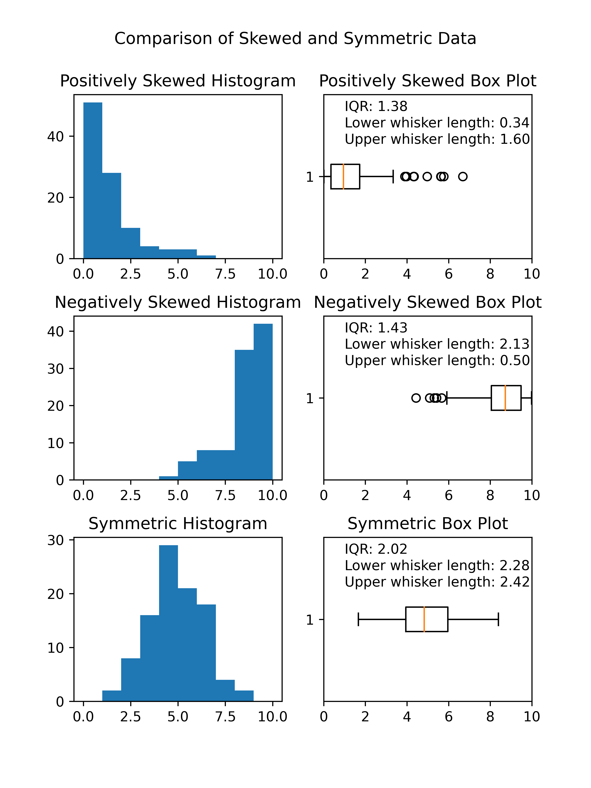

====================================================
Matplotlib box plot
====================================================

| Matplotlib can be used to draw a box plot.

----

Random box plot
-----------------------

.. image:: images/Random_box_plot.png
    :width: 600
    :align: center

----

Python code
-------------

| The python code is below.
| The code is commented to indicate what each part is doing.

.. literalinclude:: files/box_plot.py
    :linenos:

----

Comparing skewness in  box plots
---------------------------------

----

Python code
-------------

| The python code is below.
| The code is commented to indicate what each part is doing.

| The `np.random.gamma` function generates an array of random numbers from a gamma distribution. The gamma distribution is a continuous probability distribution that is often used to model positively skewed data. The shape and scale of the gamma distribution are controlled by two parameters, which are specified using the `shape` and `scale` arguments of the `np.random.gamma` function.
| The `shape` parameter, also known as the `k` parameter, controls the shape of the gamma distribution. Larger values of `shape` result in a more symmetric distribution, while smaller values result in a more positively skewed distribution.
| The `scale` parameter, also known as the `theta` parameter, controls the scale of the gamma distribution. Larger values of `scale` result in a wider distribution, while smaller values result in a narrower distribution.
| The `size` parameter specifies the number of random numbers to generate from the gamma distribution.

| The `np.random.normal` function generates random numbers from a normal distribution. The mean and standard deviation of the normal distribution are specified using the `loc` and `scale` arguments, respectively. 
| The `loc` paarmeter specifies the mean of the normal distribution.
| The `scale` paarmeter specifies the standard deviation of the normal distribution.
| The `size` argument specifies the number of random numbers to generate from the normal distribution. 

.. literalinclude:: files/box_plots_compared.py
    :linenos:
