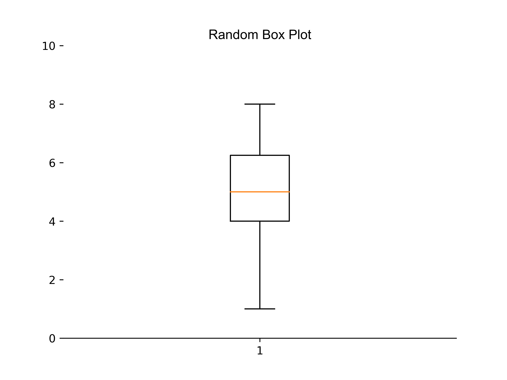

====================================================
Matplotlib box plot
====================================================

| Matplotlib can be used to draw a box plot.

----

Random box plot
-----------------------

----

Python code
-------------

| The python code is below.
| The code is commented to indicate what each part is doing.

.. literalinclude:: files/box_plot.py
    :linenos:

----

Multiple box plots
-----------------------

.. image:: images/Box_plots_compared.png
    :width: 600
    :align: center

----

Python code
-------------

| The python code is below.
| The code is commented to indicate what each part is doing.

.. literalinclude:: files/box_plots_compared.py
    :linenos:
