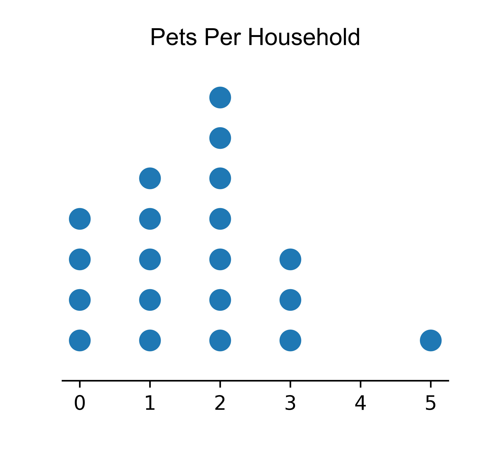
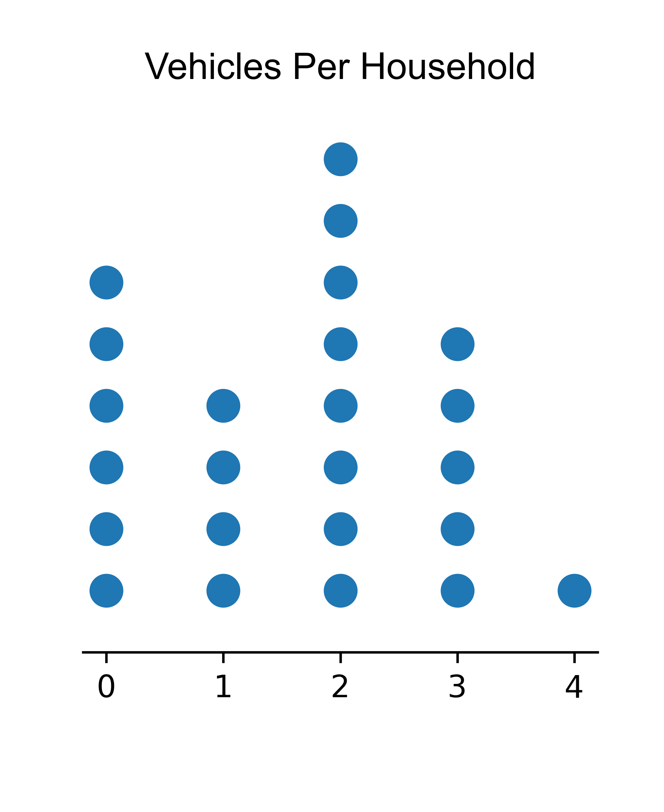
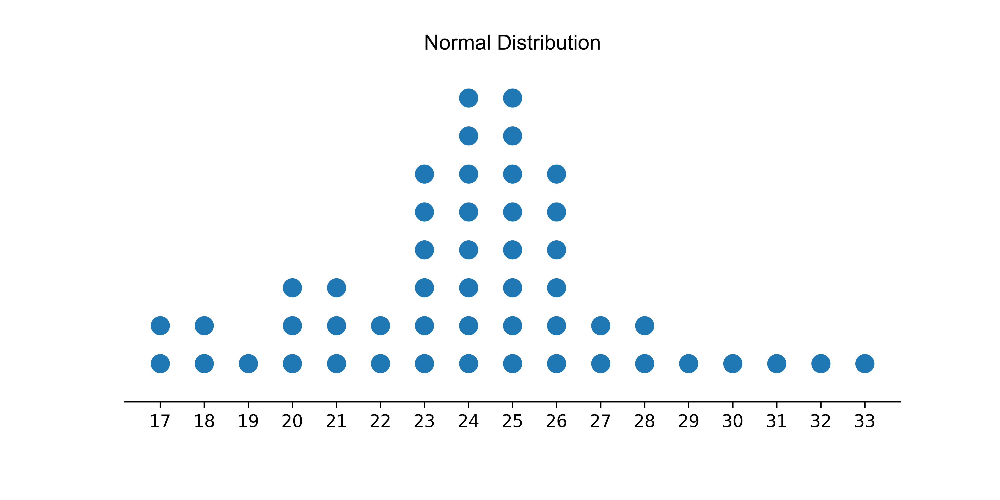

====================================================
Matplotlib dot plot
====================================================

| Matplotlib can be used to draw a dot plot.

----

Examples
-------------

.. image:: random distribution.png
    :width: 600
    :align: center

----

| The Python function, `dot_plot`, creates a dot plot.
| It takes in two arguments: `data` and `title`.
| The function creates a dot plot of the given data with the specified title.
| The data is plotted using the `matplotlib` library.
| The function first calculates the counts of each unique value in the data using the `np.unique` function from the `numpy` library.
| Then, it sets some formatting parameters based on the range and counts of the data.
| The function then creates a dot plot using a loop to plot each unique value and its count.
| The plot is formatted to hide some spines and the y-axis, set the y-axis limits, and set the x-axis ticks.
| The bottom margin is adjusted to leave space for x labels, and a title is added using the `title` argument.
| Finally, the figure is saved to a file and displayed using the `plt.show()` function.

| Below is code to create all 4 example images above.

.. literalinclude:: files/sum_consec_num1.py
    :linenos:
