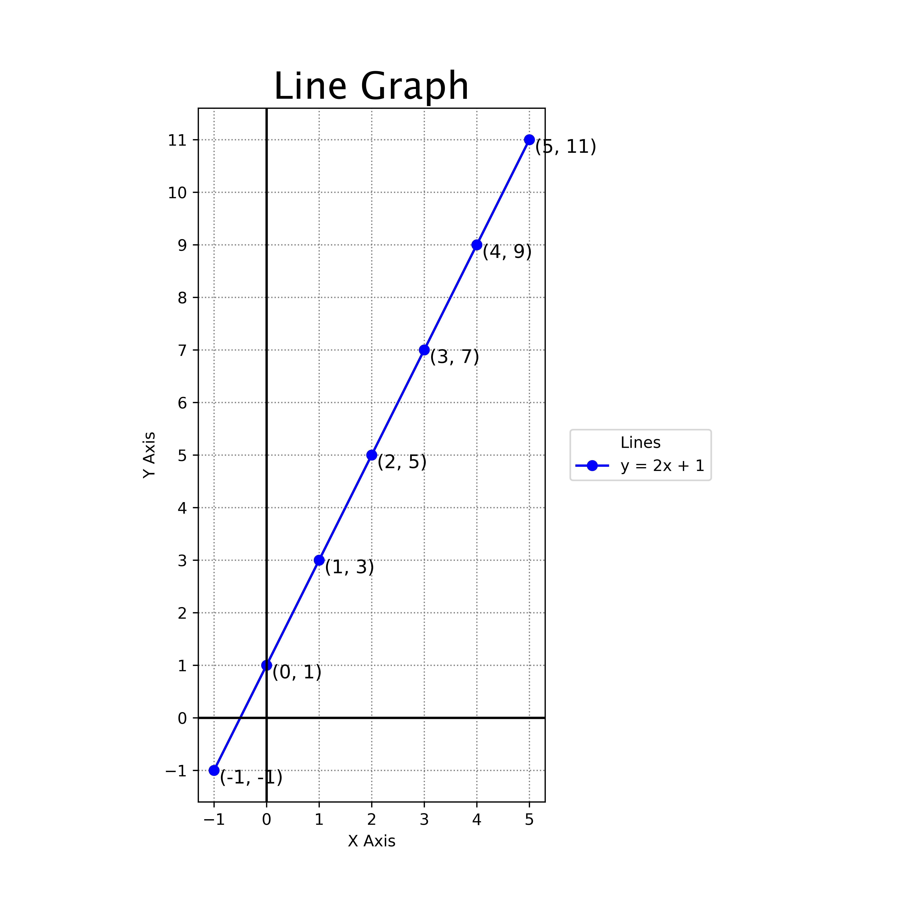
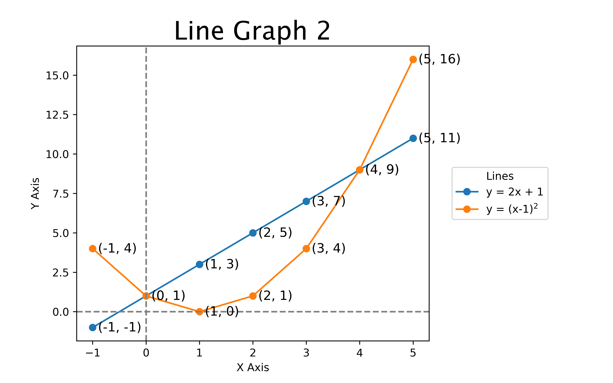

====================================================
Matplotlib line graph
====================================================

    
| Matplotlib can be used to draw a line graph.

----

Straight line graph to scale
--------------------------------

----

Python code
-------------

    
| The python code is below.

.. literalinclude:: files/line_graph.py
    :linenos:

----

Code explanation
-------------------

Here is an explanation of each line of the code with all the syntax details:

::

    from pathlib import Path
    
| This line imports the `Path` class from the `pathlib` module. The `Path` class will be used to make the file path for an image of the graph.

::

    import numpy as np
    
| This line imports the `numpy` module and gives it the conventional alias `np`. The `numpy` module will be used to make arrays.

::

    import matplotlib.pyplot as plt
    
| This line imports the `pyplot` module from the `matplotlib` library and gives it the conventional alias `plt`. The `pyplot` module provides a collection of functions for creating plots.

::

    def plot_line_graph(title, equation, label):
    
| This line defines a new function named `plot_line_graph` that takes three arguments: `title`, `equation`, and `label`. The function is used to create a line graph of the specified equation with the specified title and label.

::

    x = np.arange(-1, 6)
    
| This line creates a new variable named `x` and assigns it the value returned by calling the `arange` function from the `numpy` module. The `arange` function is called with two arguments, `-1` and `6`, which specify the start and stop values for the range of values to generate. The function returns an array of values from `-1` to `5` with a step size of `1`.

::

    y = eval(equation)
    
| This line creates a new variable named `y` and assigns it a numpy array from evaluating the expression in the string using the numpy array of x values.

::

    fig, ax = plt.subplots(figsize=(8, 8), dpi=100)
    
| This line of code that uses the `subplots` function to create a new figure and one or more subplots and a new axes object. The function returns a tuple containing a figure object and an axes object. An axes object represents a single plot or graph within a figure. It contains all the elements that make up the plot, such as the data series, axes labels, tick marks, grid lines, and title. With a reference to an axes object, you can use its methods to plot data, add labels and titles, customize the appearance of the axes and tick marks, and perform other operations on the plot.
| `figsize=(8, 8)` is a keyword argument that specifies the size of the figure in inches. In this case, it specifies that the figure should be 8 inches wide and 8 inches tall.
| `dpi=100` is a keyword argument that specifies the resolution of the figure in dots per inch. In this case, it specifies that the figure should have a resolution of 100 dots per inch.
| `fig, ax = ...` is an assignment statement that unpacks the tuple returned by the `subplots` function into two variables named `fig` and `ax`. The first element of the tuple, which is a figure object, is assigned to the variable named `fig`. The second element of the tuple, which is an axes object, is assigned to the variable named `ax`.
| After this line of code is executed, you can use the `fig` variable to refer to the newly created figure object and the `ax` variable to refer to the newly created axes object.

::

    fig.subplots_adjust(right=0.7)
    
| This line calls the `subplots_adjust` method of the figure object stored in the variable named `fig`. right=0.7 is a keyword argument that specifies the right margin of the subplots in normalized figure coordinates. In this case, it specifies that the right margin should be 0.7, which means that the subplots will occupy 70% of the width of the figure from the left edge. This adjusts the subplot parameters to make room for the legend. 

::

    ax.plot(x, y, "bo-", label=label)
    
| This line calls the `plot` function from the `pyplot` module to plot a line graph of the data stored in variables named `x` and `y`. 
| `x` and `y` are the first two arguments passed to the plot method. They are arrays of data that specify the x-coordinates and y-coordinates of the data points to plot. In this case, they are variables that contain the x and y values calculated earlier in the code.
| `"bo-"` is the third argument passed to the plot method. It is a format string that specifies how to format the data points. In this case, it specifies that the data points should be plotted as blue circles connected by solid lines. The first character, "b", specifies the color of the data points (blue). The second character, "o", specifies the marker style for the data points (circle). The third character, "-", specifies the line style for connecting the data points (solid).
| `label=label` It specifies the label for this data series in the legend. In this case, it is a variable that contains the label string specified earlier in the code.

::

    ax.axhline(0, color="k", linestyle="-")
    
| This line calls the `axhline` function from the `pyplot` module to add a horizontal line at y=0 to the current axes. The function is called with three keyword arguments: a y-value at which to draw the horizontal line, a color for the line, and a linestyle for the line.

::

    ax.axvline(0, color="k", linestyle="-")
    
| This line calls the `axvline` function from the `pyplot` module to add a vertical line at x=0 to the current axes. The function is called with three keyword arguments: an x-value at which to draw the vertical line, a color for the line, and a linestyle for the line.

::

    ax.grid(True)
    
| In this example, we call the grid method of the Axes object stored in variable named ax and pass it one argument, True, which specifies that a grid should be displayed. You can add this line of code after creating the Axes object and before calling the show method of the pyplot module to display the plot with a grid.

::

    ax.title(title, fontdict={"fontname": "Lucida Sans", "fontsize": 24})
    
| This line calls the `title` function from the `pyplot` module to add a title to the current axes. The function is called with two arguments: a string that specifies the title text and a dictionary that specifies font properties for the title text.

::

    ax.xlabel("X Axis")
    
| This line calls the `xlabel` function from the `pyplot` module to add a label to the x-axis of the current axes. The function is called with one argument: a string that specifies the label text.

::

    ax.ylabel("Y Axis")
    
    
| This line calls the `ylabel` function from the `pyplot` module to add a label to the y-axis of the current axes. The function is called with one argument: a string that specifies the label text.

::

    ax.xticks(list(x))
    
| This line calls the `xticks` function from the `pyplot` module to set the tick values for the x-axis of the current axes. The function is called with one argument: a list of tick values.

::

    ax.set_aspect('equal')
    
| This line calls the `set_aspect` method of the Axes object stored in variable named `ax`. The method is called with one argument, `'equal'`, which specifies that the aspect ratio of the axes should be set to be equal.

:: 

    for i in range(len(x)):
        ax.text(x[i]+0.1, y[i]-0.25, f"({x[i]}, {y[i]})", fontsize=12)

    
| These lines use a `for` loop to iterate over each element in variable named `x`. Inside the loop, it calls the `text` function from the `pyplot` module to add text labels to each point on the graph. The function is called with four arguments: an x-coordinate, a y-coordinate, a string that specifies the text to display, and a keyword argument named `fontsize` that specifies the font size for the text.

::

    ax.legend(title="Lines", loc='center left', bbox_to_anchor=(1.05, 0.5))
    
| This line calls the `legend` function from the `pyplot` module to add a legend to the current axes. The function is called with three keyword arguments: a string that specifies the title for the legend, a string that specifies where to place the legend relative to its anchor point, and a tuple that specifies where to place its anchor point in normalized axes coordinates.

::

    currfile_dir = Path(__file__).parent
    
| This line creates a new variable named `currfile_dir` and assigns it an object representing directory containing this script file. It does so by calling Path constructor with __file__ (a built-in variable representing path of this script file) as argument and then calling parent property of resulting Path object.

::

    filename = title.replace(" ", "_")
    
| This line creates a new variable named `filename` and assigns it value obtained by replacing all spaces in title with underscores using replace method of str objects.

::

    filepath = currfile_dir / (f"{filename}.png")
    
| This line creates new variable named filepath and assigns it value obtained by joining currfile_dir and f"{filename}.png" using / operator (which joins paths when used on Path objects).

::

    plt.savefig(filepath, dpi=600)
    
| This line calls savefig method of pyplot module to save current figure as image file at location specified by filepath variable. It also passes dpi=600 as second argument which specifies resolution of saved image in dots per inch.

::

    plt.show()
    
| This line calls show method of pyplot module which displays all figures created so far and enters main loop until all figures are closed.

::

    def main():
        plot_line_graph("Line Graph", "2 * x + 1", "y = 2x + 1")
    
| The main function will call plot_line_graph function with arguments "Line Graph", "2 * x + 1" and "y = 2x + 1" respectively.

::

    if __name__ == '__main__':
        main()
    
| These lines check if value of __name__ (a built-in variable representing name of current module) is '__main__' (which is true when script is run as main program as opposed to being imported as module) and if so calls main function.

----

Straight line graph with parabola
------------------------------------

----

Python code
-------------

    
| The python code is below.

.. literalinclude:: files/line_graph_2.py
    :linenos:

----

Code explanation
-------------------

