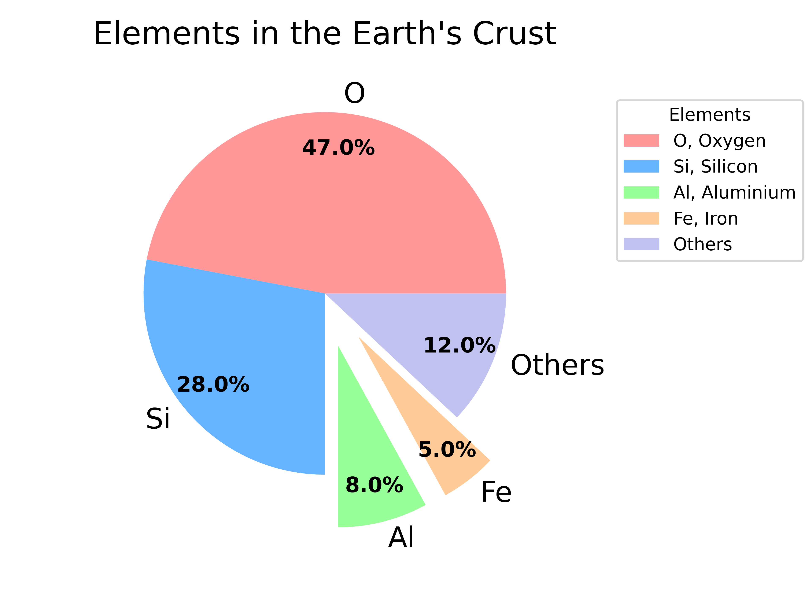

====================================================
Matplotlib pie chart
====================================================

| Matplotlib can be used to draw a pie chart.
| By default, the plotting of the first wedge starts from the x-axis and moves counterclockwise.
| The size of each wedge is determined by comparing the value with all the other values, by using this formula: the value divided by the sum of all values: x/sum(x)

----

----

Python code
-------------

| The python code is below.

.. literalinclude:: files/pie_chart.py
    :linenos:

----

Code explanation
---------------------

| ``import matplotlib.pyplot as plt`` imports pyplot for plotting.
| ``import numpy as np`` is a standard import with matplotlib, even if not used here.
| ``from pathlib import Path`` is the standard library for working with file paths and is used here so an image of the pie chart can be saved.

| ``def plot_pie_chart(data, labels, full_labels, title):`` defines a function named `plot_pie_chart` that takes four parameters. The function will use these parameters to create a pie chart with the given data, labels, a legend with the given full labels, and title.

| ``explode = [0 if x > 8 else 0.3 for x in data]`` uses a list comprehension to create a list of values that will determine how far each wedge of the pie chart should be offset from the center. The list comprehension iterates over each value in `data` and assigns a value of 0 if the value is greater than 8, or 0.3 otherwise. This means that any wedge representing a value less than or equal to 8 will be offset from the center by 0.3 units. The list ocmprehension produces this list: [0, 0, 0.3, 0.3, 0].
 
| ``colors = ['#ff9999', '#66b3ff', '#99ff99', '#ffcc99', '#c2c2f0']``  defines a list of colors to use for the pie chart. Each color is represented as a string containing a hexadecimal color code.

| ``wedges, texts, autotexts = plt.pie(data, labels=labels, autopct=lambda pct: f"{pct:.0f}%", explode=explode, pctdistance=0.8, colors=colors, startangle = 90)`` creates a pie chart with the given data and labels. The optional parameters customize the appearance of the pie chart.

- `wedges, texts, autotexts =` are returned as three lists: one containing the wedges of the pie chart, one containing their corresponding text labels, and one containing their corresponding percentage labels.
- `data` specifies the data as a list or array of non-negative numbers each of which represents the value of one wedge of the pie chart.
- `labels=labels` specifies the labels to use for each wedge of the pie chart. It should be a list or array of strings with the same length as `data`. Each string represents the label for one wedge of the pie chart.
- `autopct=lambda pct: f"{pct:.0f}%"`: This parameter specifies how to format the percentage values that are displayed on each wedge of the pie chart. In this case, we're using a lambda function that takes a percentage value as input and returns a formatted string containing the value rounded to zero decimal place and followed by a percentage sign.
- `explode=explode`: This parameter specifies how far each wedge should be offset from the center. It should be a list or array with the same length as `data`. Each number represents how far to offset one wedge of the pie chart from the center.
- `pctdistance=0.8`: This parameter specifies how far from the center of each wedge to place its percentage label. In this case, we're setting it to 0.8 which means that each label will be placed closer to its corresponding wedge than it would be by default.
- `colors=colors`: This parameter specifies what colors to use for each wedge of the pie chart. It should be a list or array of valid Matplotlib colors with at least as many elements as there are wedges in the pie chart.
- `startangle = 90` sets the start angle where the default of 0 is to the right and 90 is measured anticlockwise and so is straight up.
 
| ``plt.setp(texts, size=16)`` sets properties of all artists in one go.
| The first parameter passed into this function is an iterable containing all artists (an artist is a basic object that represents any visible element on a figure) whose properties we want to set (in this case, all text labels). The remaining parameters are pairs of property names and values specifying what properties we want to set and what values we want to set them to.
| In this case, `size=16` means that all text labels will have their font size set to 16 points.

| ``plt.setp(autotexts, size=12, weight="bold")`` sets properties of the percentage labels instead of the text labels. 
| `size=12` set all percentage labels font size to 12 points. 
| `weight="bold"` sets all percentage labels to bold font.

| ``plt.axis('equal')`` sets the aspect ratio of the plot so that the x and y axes will have the same scaling, so that circles will appear as circles and squares will appear as squares.

| ``plt.subplots_adjust(left=0.1, right=0.70, top=0.85, bottom=0.1)`` adds some space on all sides of the plot. These values are specified as fractions of the figure width and height, so a value of 0.1 means to leave 10% of the figure width or height as empty space.

| ``plt.title(title, y=1.08, size=18)`` adds a title to the plot. The `title` is a string containing the text of the title.
| The optional `y` parameter specifies how far above or below its default position to place the title. 1.08 means that the title will be placed slightly above its default position.
| The optional `size` parameter sets the font size to 18 points.

| ``plt.legend(wedges, full_labels, title="Elements", loc="upper right", bbox_to_anchor=(1, 0, 0.5, 1))`` adds a legend to the plot.

| The first parameter is an iterable containing artists whose labels we want to include in the legend (in this case, all wedges of pie chart).

| The second parameter is an iterable containing strings specifying what label text to use for each artist (in this case, all full labels).
| The optional `title` parameter specifies what text to use for legend's title (in this case `"Elements"`). 

| The optional `loc` parameter specifies where on the axes the legend should be placed. In this case, it is set to `"upper right"`, which means that the legend will be placed in the upper-right corner of the bounding box.
| The optional `bbox_to_anchor` parameter specifies a bounding box for the legend in normalized figure coordinates.
In normalized figure coordinates, the bottom-left corner of the figure is represented by the coordinates (0, 0) and the top-right corner is represented by the coordinates (1, 1). In this case, it is set to `(1, 0, 0.5, 1)`, which means that the bounding box has its bottom-left corner at `(1, 0)` (the right edge of the figure), a width of `0.5`, and a height of `1`.
| Together, these two parameters cause the legend to be placed outside the plot area, to the right of the plot and aligned with its top edge.

 
| ``currfile_dir = Path(__file__).parent`` gets the directory of the current file. 
| ``filename = title.replace(" ", "_")`` replaces all spaces in the title string with underscores and assigns resulting string to variable named `filename`.
| ``filepath = currfile_dir / (f"{filename}.png")`` creates a new Path object representing file path with filename equal to value of variable named `filename`. 
| ``plt.savefig(filepath, dpi=600)`` saves the current figure as an image file at location specified by filepath with resolution specified by dpi value.
 
