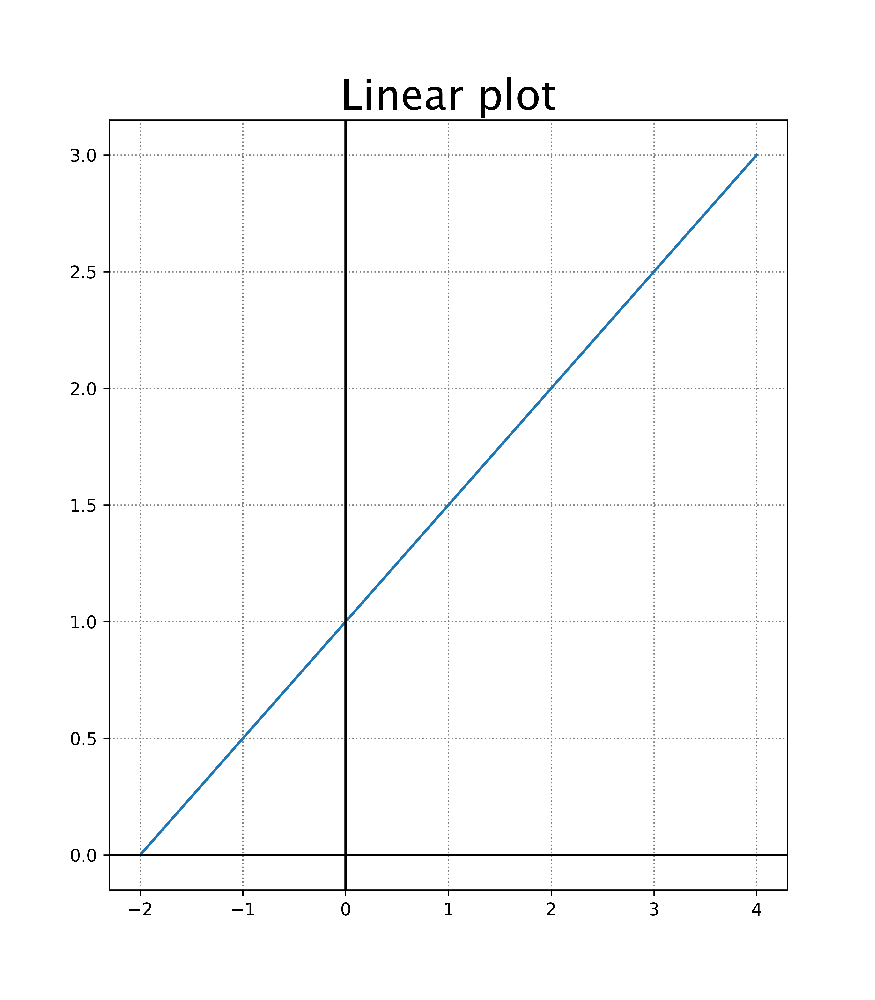

====================================================
Matplotlib plot 1 line
====================================================
    
| Matplotlib can be used to draw a line graph.

----

Simple Linear plot
--------------------------------

This is a basic plot with a grid and X and Y axes.

----

Python code
-------------

| The python code is below.
| The code is commented to indicate what each part is doing.

.. literalinclude:: files/plot_1_simple.py
    :linenos:

----

Straight line graph to scale
--------------------------------

This plot has more customizations added.

.. image:: images/Straight_line.png
    :width: 600
    :align: center

----

Python code
-------------

| The python code is below.
| The code is commented to indicate what each part is doing.

.. literalinclude:: files/plot_1.py
    :linenos:
