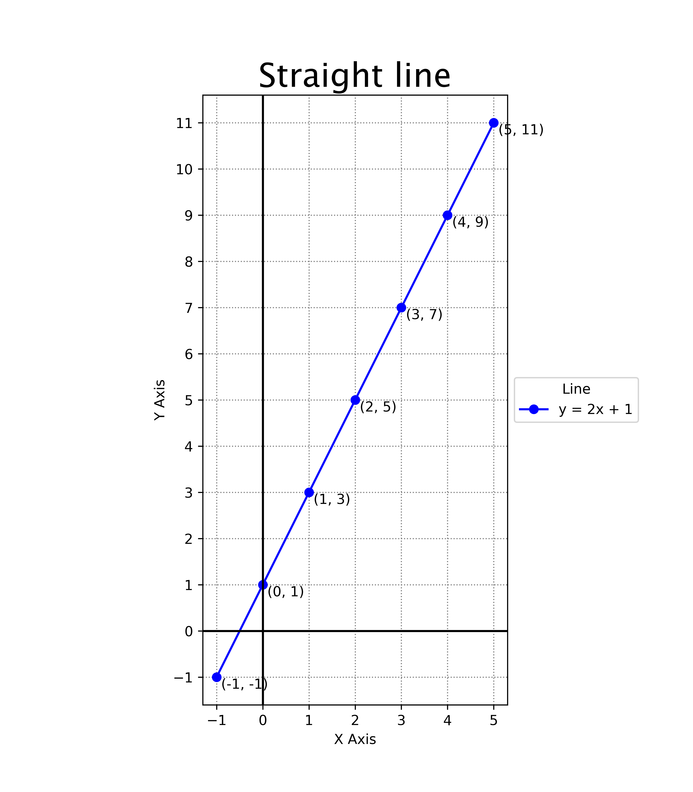

====================================================
Matplotlib plot 1 line
====================================================
    
| Matplotlib can be used to draw a line graph.

----

Straight line graph to scale
--------------------------------

----

Python code
-------------

    
| The python code is below.

.. literalinclude:: files/plot_1.py
    :linenos:

----

Code explanation
-------------------

Here is an explanation of each line of the code with all the syntax details:

::

    from pathlib import Path
    
| This line imports the `Path` class from the `pathlib` module. The `Path` class will be used to make the file path for an image of the graph.

::

    import numpy as np
    
| This line imports the `numpy` module and gives it the conventional alias `np`. The `numpy` module will be used to make arrays.

::

    import matplotlib.pyplot as plt
    
| This line imports the `pyplot` module from the `matplotlib` library and gives it the conventional alias `plt`. The `pyplot` module provides a collection of functions for creating plots.

::

    def plot_line_graph(title, equation, label):
    
| This line defines a new function named `plot_line_graph` that takes three arguments: `title`, `equation`, and `label`. The function is used to create a line graph of the specified equation with the specified title and label.

::

    x = np.arange(-1, 6)
    
| This line creates a new variable named `x` and assigns it the value returned by calling the `arange` function from the `numpy` module. The `arange` function is called with two arguments, `-1` and `6`, which specify the start and stop values for the range of values to generate. The function returns an array of values from `-1` to `5` with a step size of `1`.

::

    y = eval(equation)
    
| This line creates a new variable named `y` and assigns it a numpy array from evaluating the expression in the string using the numpy array of x values.

::

    plt.figure(figsize=(7, 8), dpi=100)
    
| This line of code that creates a new Figure object and returns it.
| A Figure object is the top-level container for all plot elements. It represents the entire window in the user interface, including the plotting area, axes, labels, titles, and legends. A Figure object can contain multiple Axes objects, which are the individual plots within the figure.  
| `figsize=(7, 8)` is a keyword argument that specifies the size of the figure in inches. In this case, it specifies that the figure should be 7 inches wide and 8 inches tall.
| `dpi=100` is a keyword argument that specifies the resolution of the figure in dots per inch. In this case, it specifies that the figure should have a resolution of 100 dots per inch.

::

    plt.plot(x, y, "bo-", label=label)
    
| This line calls the `plot` function from the `pyplot` module to plot a line graph of the data stored in variables named `x` and `y`. 
| `x` and `y` are the first two arguments passed to the plot method. They are arrays of data that specify the x-coordinates and y-coordinates of the data points to plot. In this case, they are variables that contain the x and y values calculated earlier in the code.
| `"bo-"` is the third argument passed to the plot method. It is a format string that specifies how to format the data points. In this case, it specifies that the data points should be plotted as blue circles connected by solid lines. The first character, "b", specifies the color of the data points (blue). The second character, "o", specifies the marker style for the data points (circle). The third character, "-", specifies the line style for connecting the data points (solid).
| `label=label` It specifies the label for this data series in the legend. In this case, it is a variable that contains the label string specified earlier in the code.

::

    plt.axhline(0, color="k", linestyle="-")
    
| This line calls the `axhline` function from the `pyplot` module to add a horizontal line at y=0 to the current axes. The function is called with three keyword arguments: a y-value at which to draw the horizontal line (at y=0), a color for the line (black), and a (solid) linestyle for the line.

::

    plt.axvline(0, color="k", linestyle="-")
    
| This line calls the `axvline` function from the `pyplot` module to add a vertical line at x=0 to the current axes. The function is called with three keyword arguments: a y-value at which to draw the horizontal line (at y=0), a color for the line (black), and a (solid) linestyle for the line.

::

    plt.grid(True, color='grey', linestyle=':')
    
| The grid method of the Axes object, ax, has 3 parameters here. True specifies that a grid should be displayed. The color for the line is the default grey, and the linestyle is dotted.

::

    plt.title(title, fontdict={"fontname": "Lucida Sans", "fontsize": 24})
    
| This line calls the `title` function from the `pyplot` module to add a title to the current axes. The function is called with two arguments: a string that specifies the title text and a dictionary that specifies font properties for the title text which includes Lucida Sans font at 24 pt.

::

    plt.xlabel("X Axis")
    
| This line calls the `xlabel` function from the `pyplot` module to add a label to the x-axis of the current axes. The function is called with one argument: a string, "X Axis", that specifies the label text.

::

    plt.ylabel("Y Axis")
    
    
| This line calls the `ylabel` function from the `pyplot` module to add a label to the y-axis of the current axes. The function is called with one argument: a string, "Y Axis", that specifies the label text.

::

    plt.xticks(list(x))
    
| This line calls the `xticks` function from the `pyplot` module to set the tick values for the x-axis of the current axes. The function is called with one argument: a list of tick values.

::

    y_min = int(min(y))
    y_max = int(max(y))
    plt.set_yticks(range(y_min, y_max+1))

| These set the `yticks` to a list of y values from the lowest to the highest needed for the previously given x values.

::

    plt.gca().set_aspect('equal')

| The `plt.gca` function returns the current Axes object, so calling plt.gca().set_aspect('equal') sets the aspect ratio of the current Axes object to be equal.
| This means that they have the same scale.

:: 

    for i in range(len(x)):
        plt.text(x[i]+0.1, y[i]-0.25, f"({x[i]}, {y[i]})", fontsize=10)

    
| These lines mark in the coordinates of each point by using a `for` loop to iterate over each element in variable named `x`. Inside the loop, it calls the `text` function from the `pyplot` module to add text labels to each point on the graph. The function is called with four arguments: an x-coordinate `x[i]`, a y-coordinate `y[i]`, a string that specifies the text to display `f"({x[i]}, {y[i]})"`, and a keyword argument named `fontsize` that specifies the font size of `10` for the text.

::

    plt.legend(title="Line", loc='center left', bbox_to_anchor=(1.00, 0.5))
    
| This line calls the `legend` function from the `pyplot` module to add a legend to the current axes. The function is called with three keyword arguments: a string that specifies the title for the legend, a string that specifies where to place the legend relative to its anchor point, and a tuple that specifies where to place its anchor point in normalized axes coordinates.

::

    currfile_dir = Path(__file__).parent
    
| This line gets the directory of the current file using the `__file__` attribute and the `parent` attribute of a `Path` object. The `__file__` attribute is a built-in attribute that contains the path of the current file, and the `parent` attribute of a `Path` object returns a new `Path` object representing the parent directory of the original path.

::

    filename = title.replace(" ", "_")
    
| This line creates a new variable named `filename` and assigns it value obtained by replacing all spaces in title with underscores using replace method of str objects.

::

    filepath = currfile_dir / (f"{filename}.png")
    
| This line creates new variable named filepath and assigns it value obtained by joining currfile_dir and f"{filename}.png" using / operator (which joins paths when used on Path objects).

::

    plt.savefig(filepath, dpi=600)
    
| This line calls savefig method of pyplot module to save current figure as image file at location specified by filepath variable. It also passes dpi=600 as second argument which specifies resolution of saved image in dots per inch.

::

    plt.show()
    
| This line calls show method of pyplot module which displays all figures created so far and enters main loop until all figures are closed.

::

    def main():
        plot_line_graph("Line Graph", "2 * x + 1", "y = 2x + 1")
    
| The main function will call plot_line_graph function with arguments "Line Graph", "2 * x + 1" and "y = 2x + 1" respectively.

::

    if __name__ == '__main__':
        main()
    
| These lines check if value of __name__ (a built-in variable representing name of current module) is '__main__' (which is true when script is run as main program as opposed to being imported as module) and if so calls main function.

