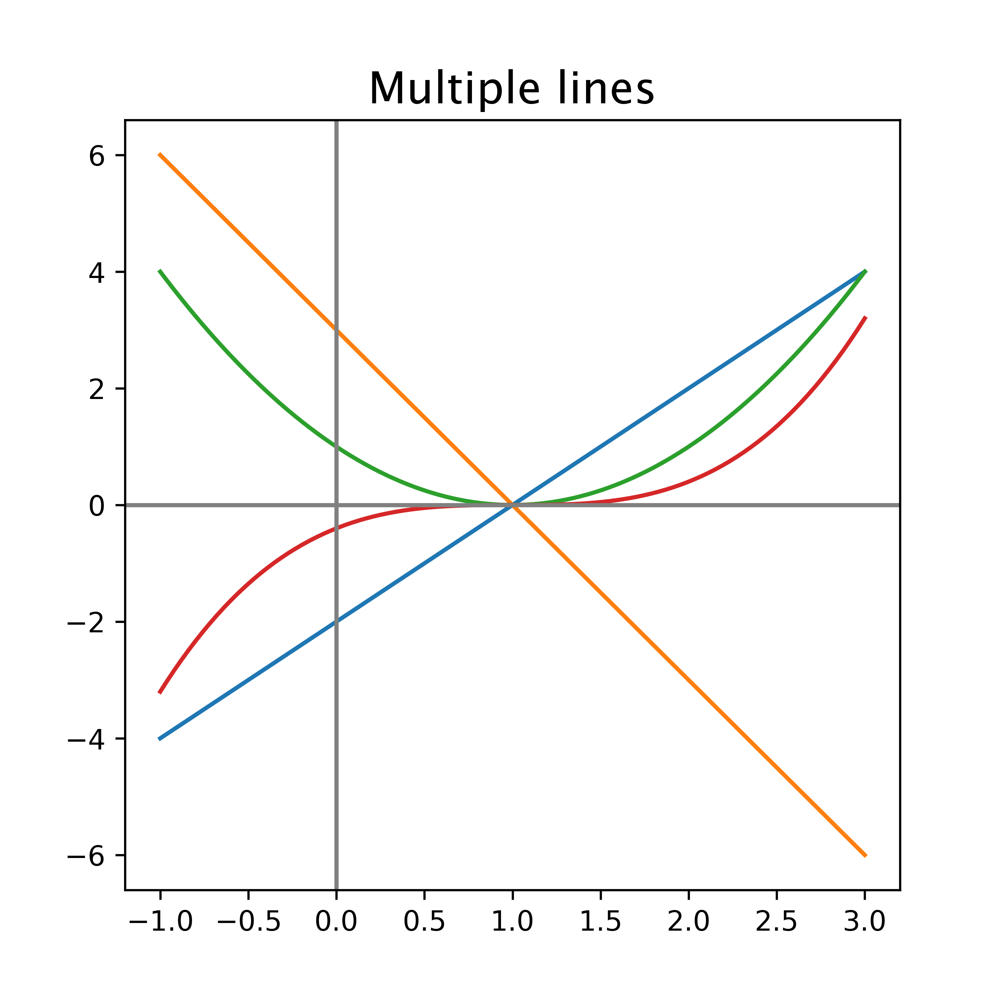

====================================================
Matplotlib plot multiple lines
====================================================

| Matplotlib can be used to draw a graph with multiple lines.

----

Simple Multiple line plot
--------------------------------

| This is a basic plot for the equations y = 2x - 2, y = -3x + 3, y = (x - 1)\ :sup:`2`\ , y = 0.4(x - 1)\ :sup:`3`\ .
| It has a grid and X and Y axes.

----

Python code
-------------

| The python code is below.
| The code is commented to indicate what each part is doing.

.. literalinclude:: files/plot_2_simple.py
    :linenos:

----

Straight line graph with parabola
------------------------------------

| This is a plot for the equation y = 2x + 1  and y = (x - 1)\ :sup:`2`\ .
| This plot has more customizations added.
| It has code to save the plot as a png file.

.. image:: images/Straight_line_and_parabola.png
    :width: 600
    :align: center

----

Python code
-------------
  
| The python code is below.
| The code is commented to indicate what each part is doing.

.. literalinclude:: files/plot_2.py
    :linenos:
