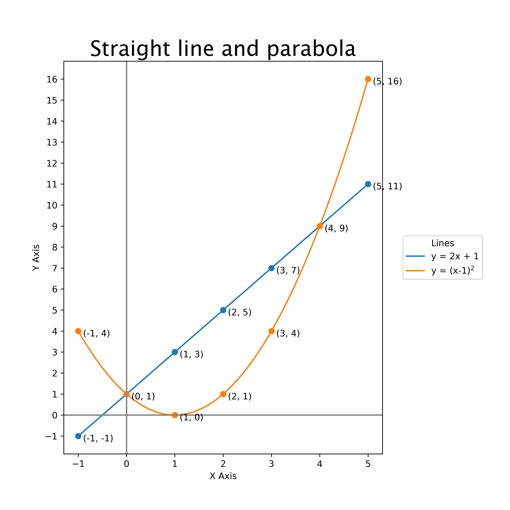

====================================================
Matplotlib plot 2 lines
====================================================

| Matplotlib can be used to draw a graph with multiple lines.

----

Straight line graph with parabola
------------------------------------

----

Python code
-------------

    
| The python code is below.

.. literalinclude:: files/plot_2.py
    :linenos:

----

Code explanation
-------------------

Here is an explanation of each line of the code with all the syntax details:

::

    from pathlib import Path
    
| This line imports the `Path` class from the `pathlib` module. The `Path` class will be used to make the file path for an image of the graph.

::

    import numpy as np
    
| This line imports the `numpy` module and gives it the conventional alias `np`. The `numpy` module will be used to make arrays.

::

    import matplotlib.pyplot as plt
    
| This line imports the `pyplot` module from the `matplotlib` library and gives it the conventional alias `plt`. The `pyplot` module provides a collection of functions for creating plots.

::

    def plot_line_graph(title, equations, labels):

This line defines a function named `plot_line_graph` that takes three arguments: `title`, `equations`, and `labels`. The function will plot line graphs of the given equations and label them with the given labels.

::

    # Define the range of x values
    x = np.linspace(-1, 5, 100)

This line creates an array of 100 evenly spaced values between -1 and 5. This array represents the range of x values that will be used to plot the line graphs. It is need to give  asmooth curve to the parabola.

::

    # Resize the Graph (dpi specifies pixels per inch. When saving probably should use 300 if possible)
    fig = plt.figure(figsize=(8, 8), dpi=100)

This line creates a new figure with a size of 8 inches by 8 inches and a resolution of 100 pixels per inch. The figure is an object that represents the entire plot or chart.

::

    # Adjust subplot parameters to make room for the legend
    fig.subplots_adjust(right=0.75)

This line adjusts the subplot parameters of the figure to make room for the legend on the right side of the plot. The `right` parameter specifies the position of the right edge of the subplots, as a fraction of the figure width.

::

    # set initial y_min and y_max that will be used for y ticks
    y_min = 0
    y_max = 0

These lines initialize two variables, `y_min` and `y_max`, that will be used to keep track of the minimum and maximum y values of all the plotted lines.

::

    for i, (equation, label) in enumerate(zip(equations, labels)):

This line starts a for loop that iterates over each equation and label in parallel. The loop variable `i` is assigned to the index of each equation/label pair, while `(equation, label)` is assigned to each pair itself.

::

    # Calculate the corresponding y values
    y = eval(equation)

This line calculates the y values for the current equation by evaluating the equation string using the `eval` function. The `eval` function takes a string argument and evaluates it as a Python expression, returning the result. It uses the x array as input to the equation to produce a y array.

::
    
    # since y is an array, need to do min(y) first before combining with y_min
    y_min = int(min(min(y),y_min))
    y_max = int(max(max(y), y_max))

These lines update the `y_min` and `y_max` variables to keep track of the minimum and maximum y values of all the plotted lines. The `min` and `max` functions are used to find the minimum and maximum values of the current line, and these values are compared to the current values of `y_min` and `y_max` to update them if necessary.

::

    # use default colours C0, C1...C9
    color = f'C{i}'

This line selects a default colour from 0 to 9.

::

    # Plot the line graph
    plt.plot(x, y, label=label, color=color)

This line plots a line on the current figure. The x and y values for the line are passed as arguments, along with a label for the line and a color.

::

    # Create a lambda function from the equation string
    f = eval("lambda x: " + equation)

This line creates a lambda function from the equation string using the `eval` function. The function, f, can now take xi as the parameter in place of x, as in f(xi). This allows the use of `yi = f(xi)` in the code below.

::

    # Label each point on the graph for x = -1 to 5 as integers
    for j in range(-1, 6):
        xi = j
        yi = f(xi)
        plt.plot(xi, yi, "o", color=color)
        if int(yi) == yi:
            plt.text(xi+0.1, yi-0.25, f"({xi}, {int(yi)})", fontsize=10)
        else:
            plt.text(xi+0.1, yi-0.25, f"({xi}, {yi:.2f})", fontsize=10)

These lines label each point on the graph where x is an integer between -1 and 5. A nested for loop is used to iterate over these x values. For each x value, the corresponding y value is calculated using the lambda function created earlier. A point is plotted at this (x,y) location using the `plot` function with marker style `"o"` to indicate that a circle should be used as the marker. Then, text is added to label this point using the `text` function from the `pyplot` module. The text is positioned slightly to the right and below the point, and the text string is formatted using an f-string to include the x and y values. If the y value is an integer, it is displayed as an integer, otherwise it is displayed with two decimal places.

    
::

    # Calculate the corresponding y values for both lines
    y1 = eval(equations[0])
    y2 = eval(equations[1])            
    # Fill the area between the two lines
    plt.fill_between(x, y1, y2, where=(y1 > y2), interpolate=True, color='green', alpha=0.2)
    plt.fill_between(x, y1, y2, where=(y1 <= y2), interpolate=True, color='red', alpha=0.2)

The `fill_between` function fills the area between two plotted lines. This code calculates the `y` values for both lines using the given equations and plots them. Then it uses the `fill_between` function to fill the area between the two lines with a color. The `where` parameter specifies a condition that determines which regions to fill. In this example, we fill the region where `y1 > y2` with green color and where `y1 <= y2` with red color. The `interpolate` parameter specifies whether to interpolate between the two lines to find the precise boundary of the filled region. The `alpha` parameter controls the transparency of the fill color.

::

    # Add a x, y axis lines through the origin
    plt.axhline(0, color="gray", linestyle="-")
    plt.axvline(0, color="gray", linestyle="-")

These lines add horizontal and vertical lines through the origin (0,0) using the `axhline` and `axvline` functions from the `pyplot` module. The lines are styled to be gray and have a solid line style.

::

    # Add a title (specify font parameters with fontdict)
    plt.title(title, fontdict={"fontname": "Lucida Sans", "fontsize": 24})

This line adds a title to the plot using the `title` function from the `pyplot` module. The title text is passed as an argument, along with a dictionary of font parameters that specify the font name and size.

::

    # X and Y labels
    plt.xlabel("X Axis")
    plt.ylabel("Y Axis")

These lines add labels to the x and y axes using the `xlabel` and `ylabel` functions from the `pyplot` module. The label text is passed as an argument.

::

    # specify X axis Tickmarks (will resize graph)
    plt.xticks(np.arange(-1, 6))

This line specifies the tick marks for the x axis using the `xticks` function from the `pyplot` module. An array of tick mark locations is passed as an argument, which is created using the `arange` function from the `numpy` library to generate an array of values from -1 to 5.

::

    # Set y-axis tick marks to be every 1
    plt.yticks(range(y_min, y_max+1))

This line specifies the tick marks for the y axis using the `yticks` function from the `pyplot` module. A range of tick mark locations is passed as an argument, which is created using the built-in `range` function to generate a range of values from `y_min` to `y_max`.

::

    # Place legend outside plot at top right, making extra room for it
    plt.legend(title="Lines", loc='center left', bbox_to_anchor=(1.05, 0.5))

This line adds a legend to the plot using the `legend` function from the `pyplot` module. The legend title and location are specified as arguments. The location is specified as `'center left'`, which means that the legend will be placed outside the plot to the left of the center. The `bbox_to_anchor` argument is used to specify the exact location of the legend in normalized figure coordinates.

::

    # Get the directory of the current file
    currfile_dir = Path(__file__).parent

This line gets the directory of the current file using the `__file__` attribute and the `parent` attribute of a `Path` object. The `__file__` attribute is a built-in attribute that contains the path of the current file, and the `parent` attribute of a `Path` object returns a new `Path` object representing the parent directory of the original path.

::

    # Replace spaces in title with underscores to create filename for saving figure
    filename = title.replace(" ", "_") 

This line creates a new variable named `filename` and assigns it value obtained by replacing all spaces in title with underscores using replace method of str objects.

::

    filepath = currfile_dir / (f"{filename}.png")

This line creates new variable named filepath and assigns it value obtained by joining currfile_dir and f"{filename}.png" using / operator (which joins paths when used on Path objects).

::

    # Save figure (dpi 300 is good when saving so graph has high resolution)
    plt.savefig(filepath, dpi=600)

This line calls `savefig` method of pyplot module to save current figure as image file at location specified by `filepath` variable. It also passes `dpi=600` as second argument which specifies resolution of saved image in dots per inch.

::

    # Show plot
    plt.show()

This line displays the plot on screen using the `show` function from the `pyplot` module.

::

    def main():
        plot_line_graph("Straight line and parabola", ["2 * x + 1", "(x-1)**2"], ["y = 2x + 1", r"y = (x-1)$^2$"])

This line defines a `main` function that calls the `plot_line_graph` function with three arguments: `title`, `equations`, and `labels` to plot a straight line and a parabola.

::

    if __name__ == '__main__':
        main()

These lines check if this file is being run as a script (as opposed to being imported as a module) using the built-in `__name__` attribute. If this file is being run as a script, then the `main` function is called to execute it.
