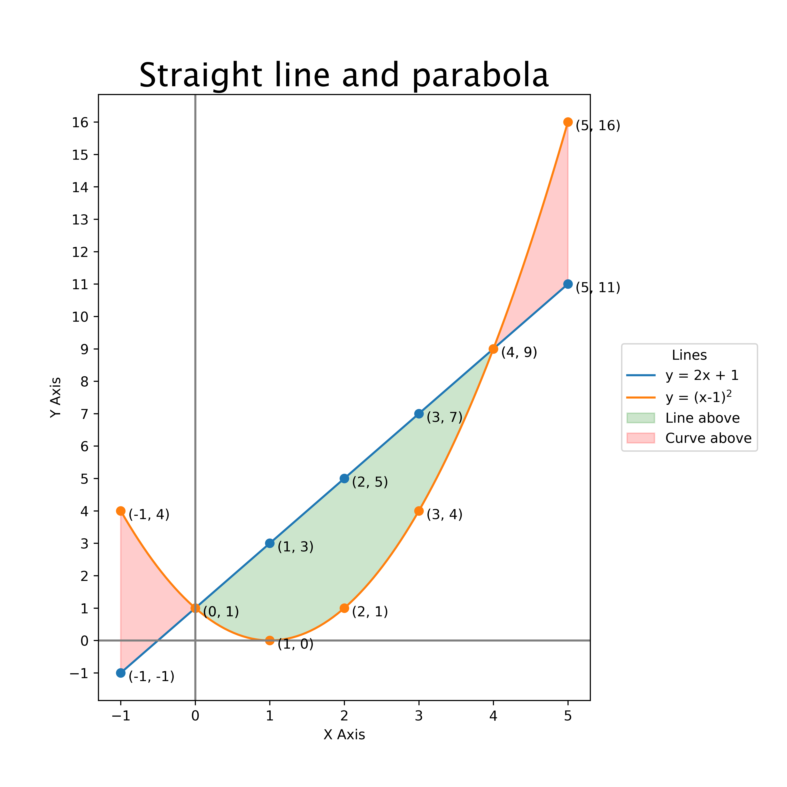

====================================================
Matplotlib plot 2 lines
====================================================

| Matplotlib can be used to draw a graph with multiple lines.

----

Straight line graph with parabola
------------------------------------

----

Python code
-------------
  
| The python code is below.
| The code is commented to indicate what each part is doing.

.. literalinclude:: files/plot_2.py
    :linenos:
