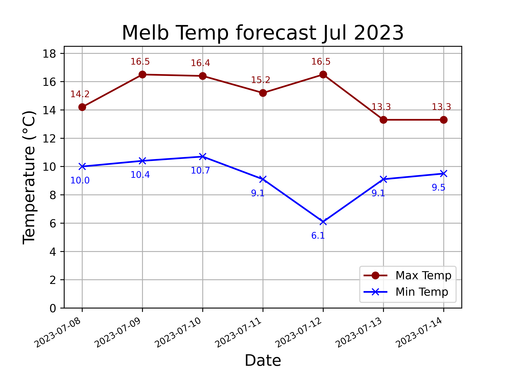

====================================================
Matplotlib plot json
====================================================

| Matplotlib can be used to draw a graph of json data from the web.

----

Temperature forecast
------------------------------------

----

Python code
-------------

    
| The python code is below.
| The code is commented to indicate what each part is doing.

.. literalinclude:: files/plot_web_json.py
    :linenos:

